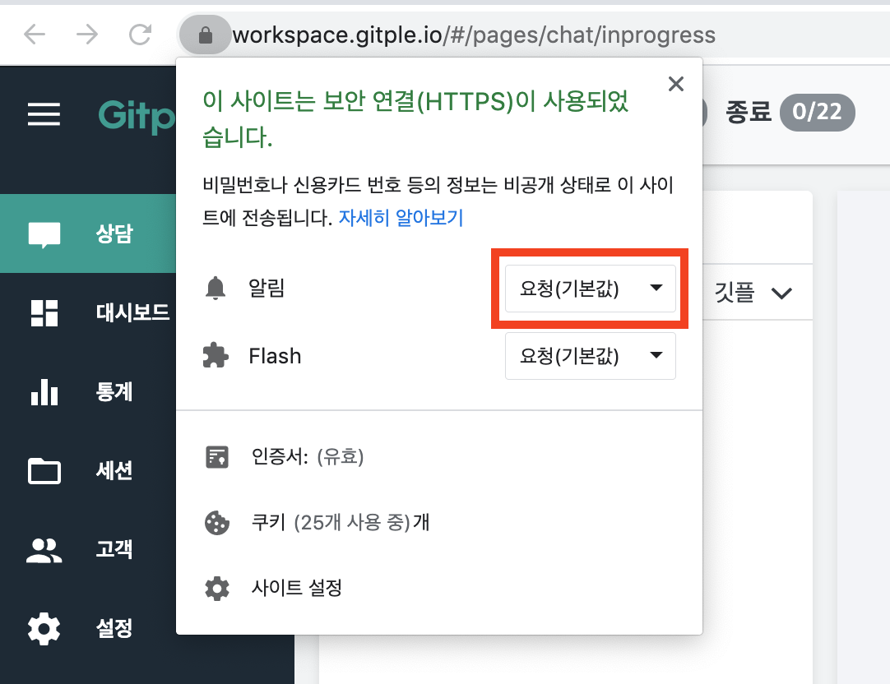
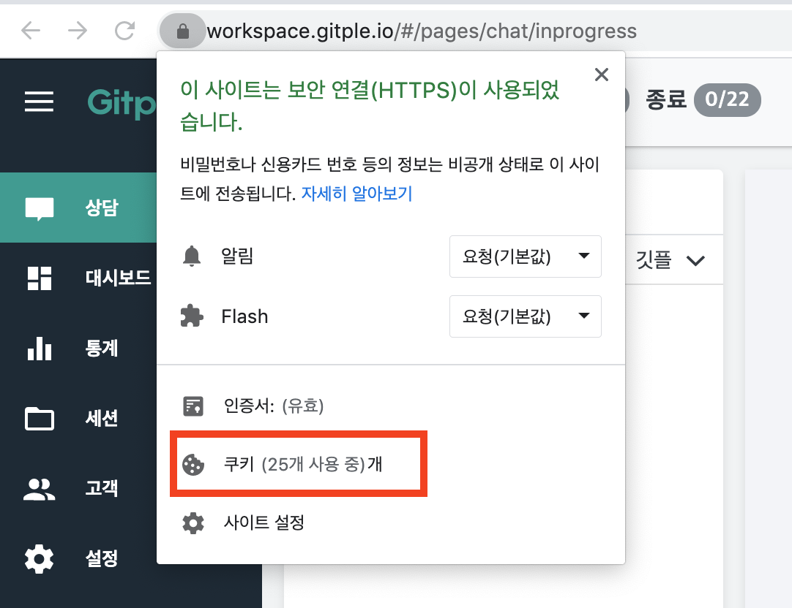
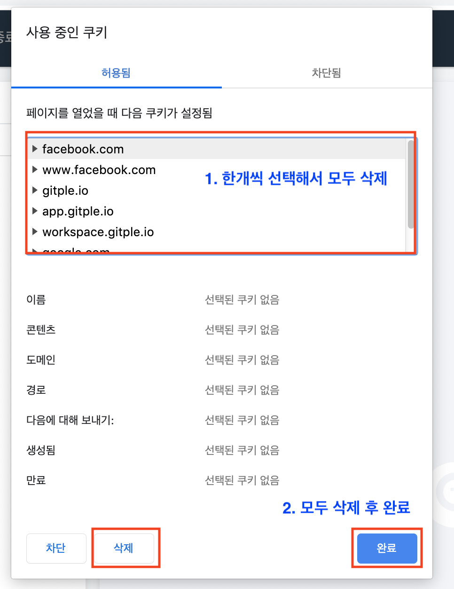
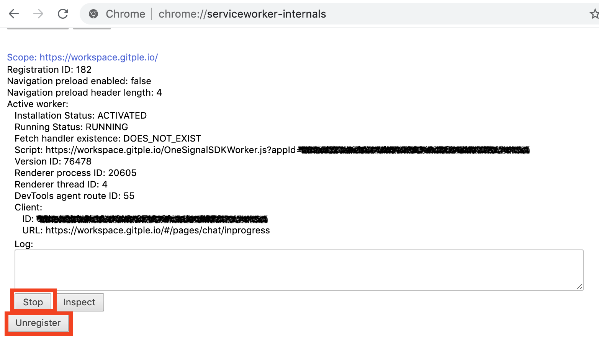

하이브리드 채팅상담 [깃플](https://gitple.io)

# 데스크탑 알림 문제 해결 방법

?> 알림 발생 및 설정에 대해서 보다 자세히 알고 싶으시면 [데스크탑/모바일 기본 알림 받기](alerts.md)를 참고해주세요.

### 크롬브라우저 알림 초기화 방법

크롬브라우저에서 알림이 정상적으로 오지 않을 경우 등록된 정보를 초기화 하는 방법입니다.

##### 1. [깃플 워크스페이스](https://workspace.gitple.io/) 접속해서 사용자 계정으로 로그인

##### 2. 주소창 오른쪽 자물쇠 선택 후 알림을 기본값으로 변경

##### 3. 주소창 오른쪽 자물쇠 선택 후 쿠키 메뉴에서 전체 쿠키 삭제

!> 쿠키 삭제 후에는 **반드시 크롬 브라우저를 종료 후에 다시 시작**해야 합니다. 

##### 4. 크롬 정보에서 깃플 서비스 워크 삭제
  - 크롬 브라우저의 주소 창에 `chrome://serviceworker-internals/`을 입력 후에 `https://workspace.gitple.io/` 부분을 찾습니다.
  - 찾은 부분에 있는 `Stop` and `Unregister`를 순서대로 선택합니다.
  

?> 마직막으로 새로운 탭에서 [깃플 워크스페이스](https://workspace.gitple.io/)로 접속을 하시고 알림이 정상 동작하는지 확인하시면 됩니다.

*현재 페이지의 끝부분 입니다.*

---

© Gitple Inc. All Rights Reserved.
