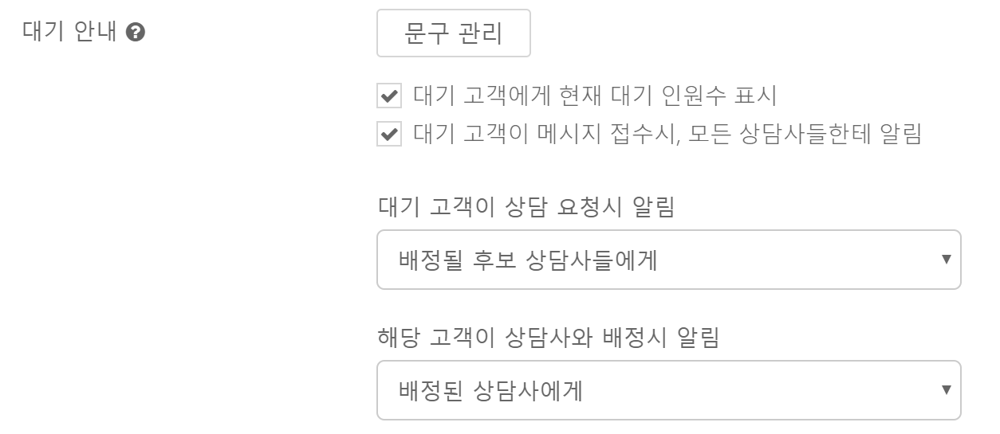
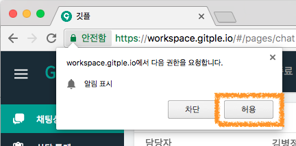
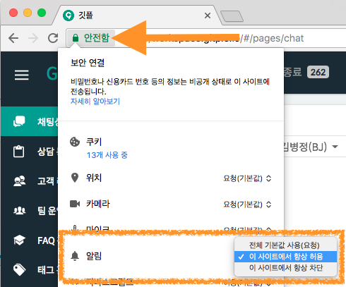
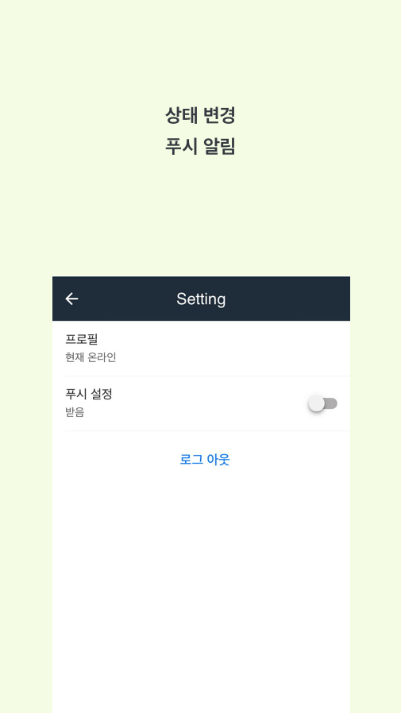

하이브리드 채팅상담 [깃플](https://gitple.io)

# 데스크탑 알림 

"**설정 > 앱관리**" 의 "**대기 안내**" 설정을 해놓으면, 알림이 발생됩니다.

알림 크게 3가지로 구분됩니다.

| 알림 조건 | 알림 대상 |
|---------- | -------- |
| 대기 고객이 메시지 접수시 | 모든 상담사들 / 사용안함|
| 대기 고객이 상담 요청시 | 모든 상담사들 / 배정될 후보 상담사들 / 사용안함 |
| 해당 고객이 상담사와 배정시 | 모든 상담사들 / 배정될 후보 상담사들 / 배정된 상담사 / 사용안함 |

?> `배정될 후보 상담사들`은 스킬 배정은 혹은 전달 기능을 통해서 특정 상담사(들)가 지정된 경우에 해당합니다.

!> 알림 발생에 대해서 보다 자세히 알고 싶으시면, [알림 상황 이해하기](alertscases.md)편을 참고해주세요.

### 크롬브라우저 설정 방법

크롬브라우저에서 지원하는 데스크톱 알림 기능을 이용할 수 있습니다.

##### 워크스페이스 접속시 아래와 같은 `알림 표시` 여부에서 허용을 해주시면 됩니다.
  

##### 이후, 설정 변경을 원하시면 주소창의 왼쪽 부분을 클릭해서, `알림` 부분의 값을 조정하시면 됩니다.
  
  

### 워크스페이스 모바일 버전 설정 방법

설정의 푸시 알림 받기가 활성화 되어있어야 합니다.

  

참고, 모바일 앱은 프로 요금제 이상부터 접속 가능합니다.
- Google Play 의 [안드로이드 앱](https://play.google.com/store/apps/details?id=com.gitpleapp)
- App Store 의 [아이폰 앱](https://apps.apple.com/kr/app/gitple-workspace-%EA%B9%83%ED%94%8C-%EC%9B%8C%ED%81%AC%EC%8A%A4%ED%8E%98%EC%9D%B4%EC%8A%A4/id1459615463)

*현재 페이지의 끝부분 입니다.*

---

© Gitple Inc. All Rights Reserved.
