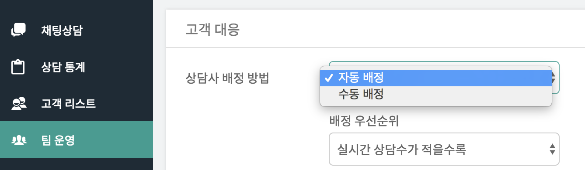

하이브리드 채팅상담 [깃플](https://gitple.io)

## 자동 배정 
 
우선, 설정 방법은 아래와 같이 해주시면 됩니다.
세부 설명은 [여기](ws-settings-routing.md)에 자세히 나와있습니다.

고객 문의를 실시간으로 처리하는 방식이기에 아래와 같은 상황에서 사용되는 것을 추천드립니다.
- 전문 상담사가 1명이라도 있는 경우
- 전문 상담사는 아니지만, 항상 워크스페이스를 열어 놓고 업무를 볼 수 있습니다.
- 이벤트 등 특정 기간에만 한시적으로 많은 고객을 감당해야할 경우

이상입니다. 보다 궁금한 사항은 언제든지 채팅상담으로 말씀주세요!

!> 상담 수가 적어서 전담 상담사를 두고 있지 않다면?  [수동 배정](./manualrouting.md)

---

© Gitple Inc. All Rights Reserved.
