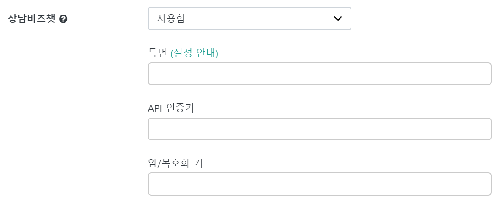
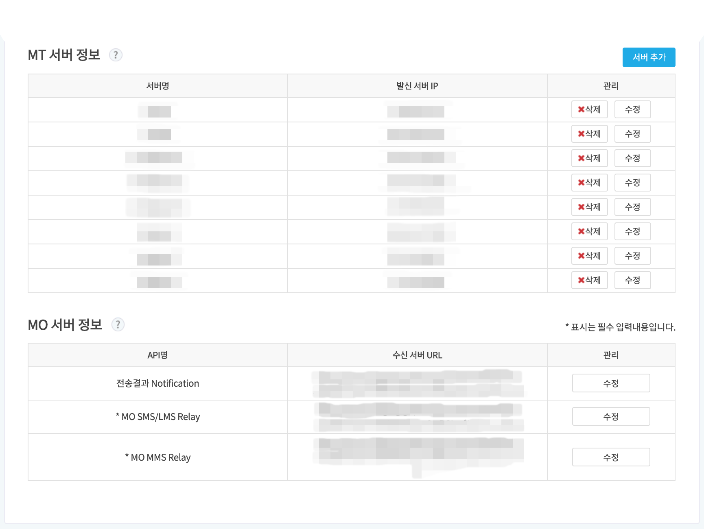

하이브리드 채팅상담 [깃플](https://gitple.io)

# 상담비즈챗

상담비즈챗을 이용하기 위해서는 깃플챗의 회원가입 뿐만 아니라, SMS 서비스인 비즈챗에도 회원가입이 필요합니다.

[bizchatservice](https://bizchatservice.co.kr/) 사이트에서 회원가입을 진행하시면 됩니다.

* 딜러사에 `깃플`을 입력하시면 됩니다.
* MT 및 MO 서버 정보는 아래 깃플챗 연동 설정이 완료된 후에 가능합니다.

### 깃플챗 연동 설정

비즈챗 `서버 정보 관리` 탭의 내용을 참고하여, 워크스페이스 "**설정 > 연동**" 메뉴에 해당 값을 입력합니다.

* 특번
  * 비즈챗에서 발급받은 #0000으로 시작하는 8자리 번호를 뜻합니다.
* API 인증키
  * 비즈챗 API 연동시 인증을 위한 키 값입니다.
* 암/복호화 키
  * 비즈챗 API 연동시 암호화 및 복호화를 하기 위한 키 값입니다.

### 비즈챗 연동 설정

비즈챗 설정화면에서 MT 서버정보, MO 서버정보를 입력받기 위해서 깃플에 요청합니다.

* 요청 방법은 워크스페이스에서 바로 채팅문의로 주시거나, help@gitple.com 으로 메일주시면 됩니다.

---

© Gitple Inc. All Rights Reserved.
