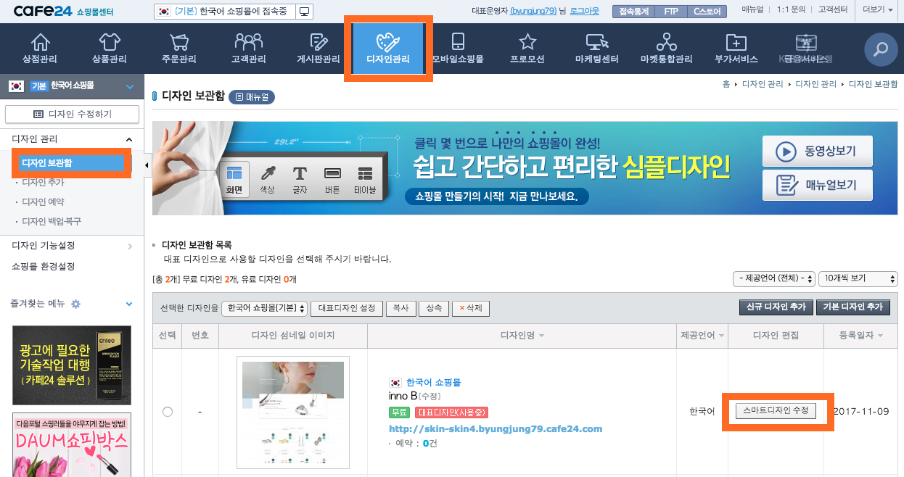
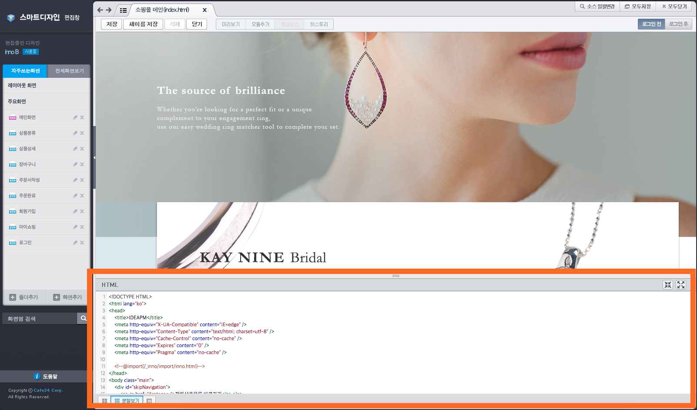
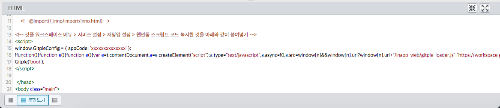
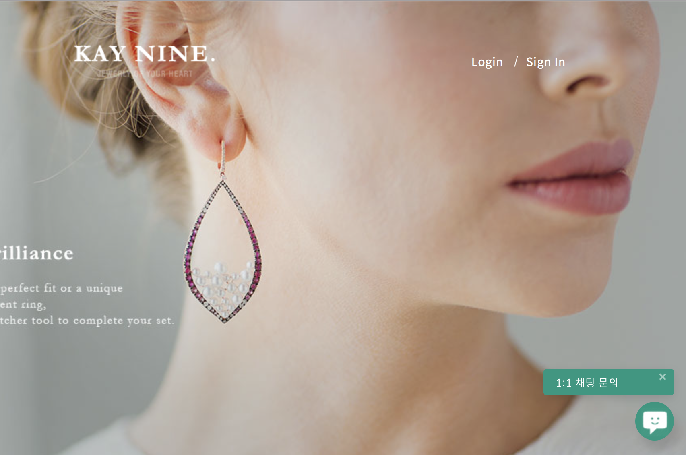

하이브리드 채팅상담 [깃플](https://gitple.io)

# 까페24 쇼핑몰(cafe24) 연동 가이드

까페24 쇼핑몰 주소 - https://echosting.cafe24.com

#### 1. 관리자 페이지에 접속한 후, `디자인관리` > `디자인 보관함` > `스마트디자인 수정` 을 차례로 실행합니다.

!> 디자인 중 `심플디자인` 은 쇼핑몰 자체에서 스마트디자인 수정을 제공하지 않습니다.

#### 2. 스마트 디자인 편집창에서 `HTML` 수정하는 부분을 찾습니다.

#### 3. HTML 스크립트 복사하기
* 깃플 워크스페이스 > "**설정 > 연동**" > "웹연동 스크립트 코드" 속성에서 HTML 코드 복사
* 아래 그림과 같이 `</head>` 태그 바로 앞 부분에 HTML 코드를 붙여넣음
  

!> 붙여넣기를 하신 후에, 오른쪽 위의 `저장` 하기를 잊지 마세요.

?> 모바일 쇼핑몰이 별도로 구성된 경우, 모바일 편집창에서도 마찬가지로 적용해주시면 됩니다.

### 서비스 시작

홈페이지에 접속해보시면, (기본) 오른쪽 하단에 여러분 만의 채팅상담 서비스가 가능해진 것을 확인할 수 있습니다.

이상입니다.

아직 계정이 없으시다구요? [무료 회원 가입](https://workspace.gitple.io/#/register)

---

© Gitple Inc. All Rights Reserved.
