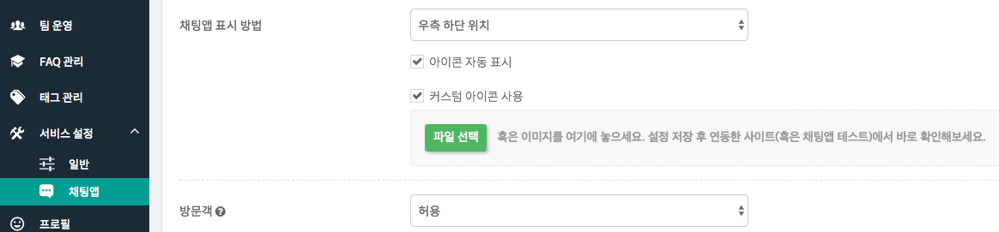
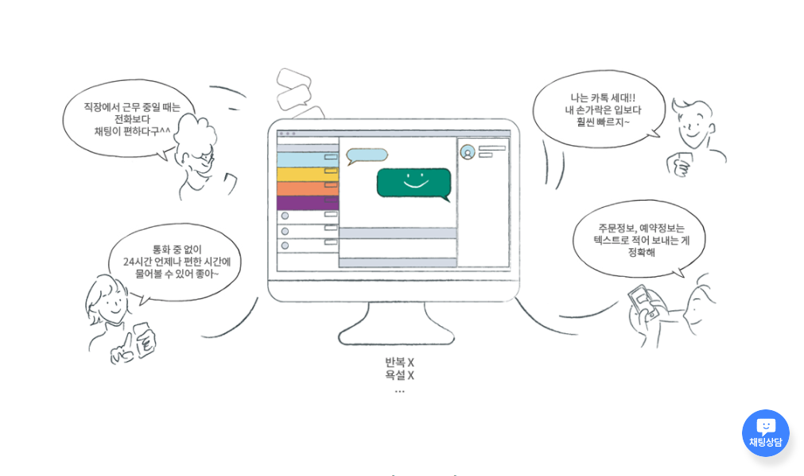
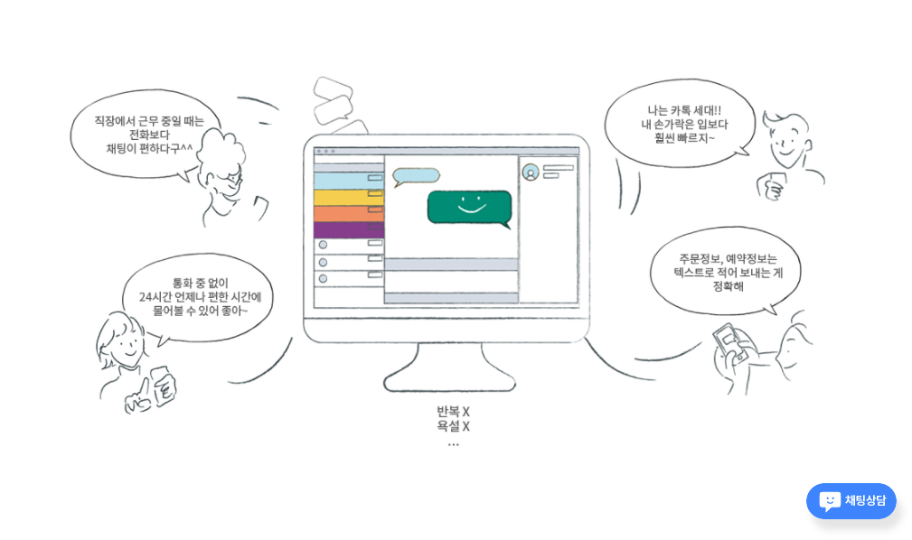

하이브리드 채팅상담 [깃플](https://gitple.io)

## 나만의 채팅 아이콘

기본 제공되는 아이콘말고 나만의 아이콘을 적용하는 방법에 대해서 설명드립니다.

아래 화면과 같이 워크스페이스에서 "**설정 > 채팅앱**" 에서 "**커스텀 아이콘 사용**"을 체크하신 후, 파일을 업로드 하시면 됩니다.




업로드 하셨다면, 화면 아래 "**저장하기**"를 누르시고 실제 연동한(혹은 채팅앱 테스트 메뉴) 사이트에서 확인하실 수 있습니다.

#### 기본 아이콘


#### 커스텀 아이콘 예시1 


#### 커스텀 아이콘 예시2 



?> 좀더 **다양한 효과**를 원하시면 아래 `팁(Tip)`을 참고해 보세요.

### Tip-1
##### 해당 이미지가 `입체적`으로 보이도록 하려면, 이미지 자체를 입체적으로 제작하거나 아래와 같이 css 속성을 추가합니다.

```css
/* 커스텀 아이콘에 css 속성 추가 */
#gitple-launcher-custom-icon {
   border-radius: 30px;
   box-shadow: rgba(0, 0, 0, 0.1) 6px 12px 12px;
}
```

### Tip-2
##### 채팅 아이콘에 `투명도`를 넣거나 `색상`을 변경하려고 할 때 다음과 같이 css 속성을 추가합니다. 

```css
  /**
   * red 테마에서 아이콘에 투명도만 추가하는 예제 
   */

  /* 채팅앱이 닫혀 있을 때 여는 아이콘에 투명도 추가 */
  #gitple-launcher-icon.gitple-open {
    background-color: rgba(245, 63, 63, 0.5) !important;
  }
  /* 채팅앱이 열려 있을 때 닫는 아이콘에 투명도 추가 */
  #gitple-launcher-icon.gitple-close {
    background-color: rgba(86, 86, 86, 0.5) !important;
  }
  /* 툴팁에 투명도 추가 */
  #gitple-launcher-tooltip {
    background-color: rgba(245, 63, 63, 0.5) !important;
  }
```

---

© Gitple Inc. All Rights Reserved.
