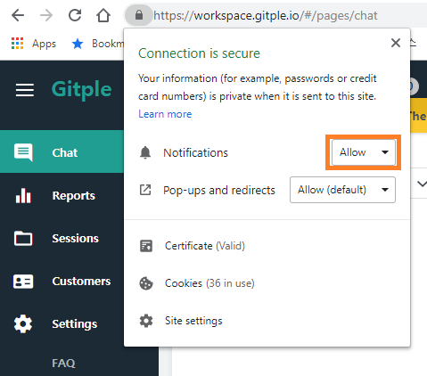
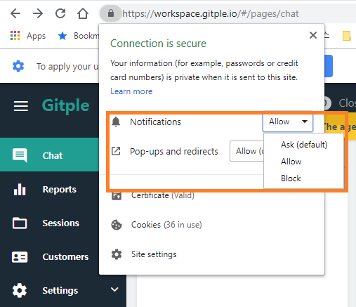

Hybrid Chatting [Gitple](https://gitple.io/en)

You can recognize your customer's inquiry by setting   "**Situation guide**" in "**Settings > Apps**” even though you don’t open the workspace and wait all the time.

## Chrome Browser
You can use the desktop notification function that is supported by the Chrome browser.

##### When connecting the workspace, select Allow on the Show alert window as shown below.
  

##### Then, if you want to change the settings, click the left part of the address bar and adjust the value in the Notification section.
  
  
*The end of the current page.*

---

© Gitple Inc. All Rights Reserved.
