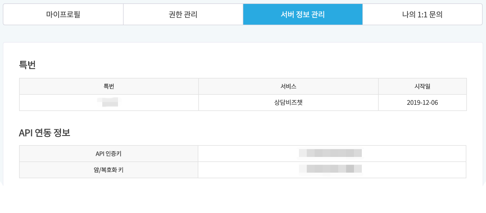
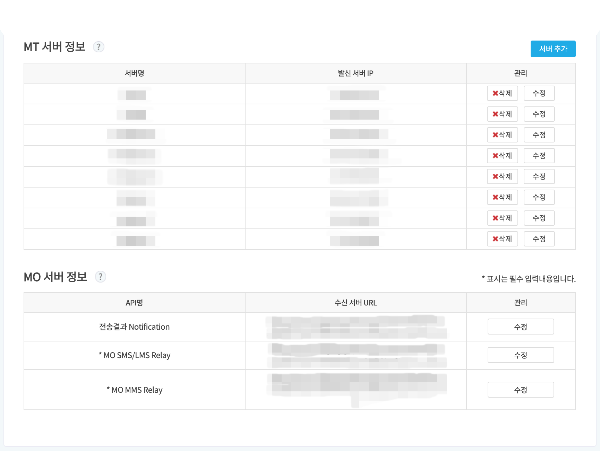

Hybrid Chatting [Gitple](https://gitple.io/en)

# BizChat

BizChat only supports Korean.

In order to use BizChat, you need not only to sign up for Gitple, but also to BizChat for SMS service.

## BizChat Signup

You can register on the [bizchatservice](https://bizchatservice.co.kr/) site.

* Dealer: `Gitple`
* MT and MO server information is available only after the completion of the following Gitple integration.

## Gitple Integration

Workspace > "**Settings > Integration**"

* Number
   * 8-digit number starting with #0000 issued by BizChat.
* API authentication key
   * Key value for authentication when connecting Bizchat API.
* Encryption / Decryption Keys
   * Key value for encryption and decryption when Bizchat API is called.

## BizChat Integration

In order to receive MT server information and MO server information from the BizChat setup screen, you should ask the Gitple.

* You can chat directly in the workspace or email help@gitple.com.

---

© Gitple Inc. All Rights Reserved.
