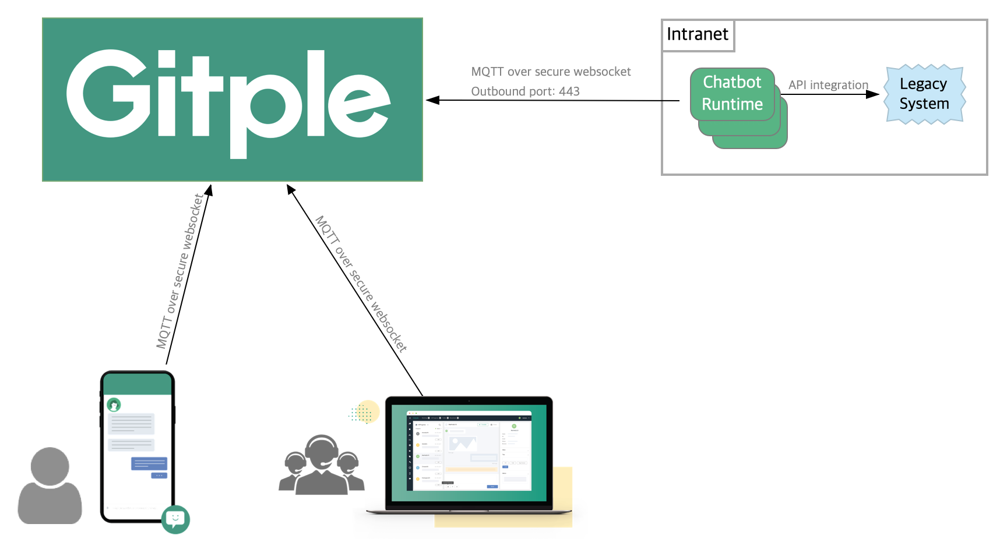

Hybrid Chatting [Gitple](https://gitple.io/en)

# Bot Integration Guide

Gitple Bot system supports all the 3rd party chatbot engines.

## Bot System Architecture


## Bot SDK

### Basic

Basic SDK use the Nodejs interface.

#### [Gitple-Bot SDK](https://github.com/gitple/gitple-bot-node)

### Extensions

Gitple Bot SDK supports various extension interfaces based on Basic SDK above.

_Please let us know if there is another extension that needs to be supported!_

| Exntesion Interface  | Description |
|-----------------| -------|
| [Gitple-Bot-RiveScript](https://github.com/gitple/gitple-bot-rivescript-node) | RiveScript(www.rivescript.com) language SDK for Gitple |
| [Gitple-Bot-Dialogflow](https://github.com/gitple/gitple-bot-dialogflow-example) | Google Dialogflow(dialogflow.com) example for Gitple |

## Bot Integration

> The extended interface bot makes it simple to run a bot Integration test.

1. Download the [Gitple-Bot-RiveScript SDK](https://github.com/gitple/gitple-bot-rivescript-node) and have a bot ready to integration.

  Please refer to the [README](https://github.com/gitple/gitple-bot-rivescript-node/blob/master/README.md) for how to start the bot.

2. You can add bots from the Workspace > Settings > **Bots** menu.

  

  Please select **Bots**.

  

3. Click the **Add Bot** button, enter the name of the bot, select the app to be integrated, and create it.

  You can configure the startup bot as needed. When setting up a startup bot, the startup bot takes precedence even if the FAQ guide bot setting is enabled.

  

4. When you add a bot, you can see it in the list. Click the **config** icon to download the config file.

  

5. Replace the downloaded **config.json** file with the bot's config.json file.

  ```config.json
  # Each property is automatically generated based on the selected app.
  {
    "BOT_ID": BOT_ID,
    "BOT_GATEWAY_SECRET": BOT_GATEWAY_SECRET,
    "APP_CODE": APP_CODE
  }
  ```
6. Start the bot and it will automatically link with the Workspace app!!

  You can now check the bot integration through the chat app test.

  [Chat App Test](https://guide.gitple.io/#/en/howto?id=settings-gt-chat-app-test) ← Please check this link to test your chat app.

---

Don’t you have an account yet? [Free membership](https://workspace.gitple.io/#/register/en)

---

© Gitple Inc. All Rights Reserved.
