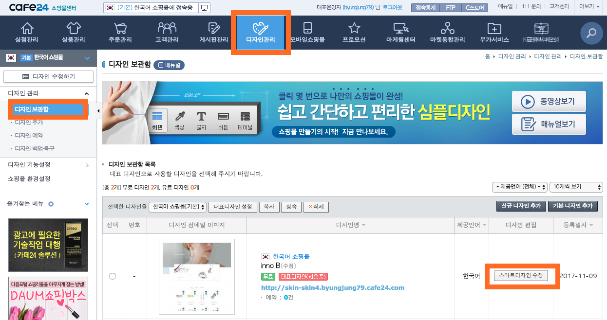
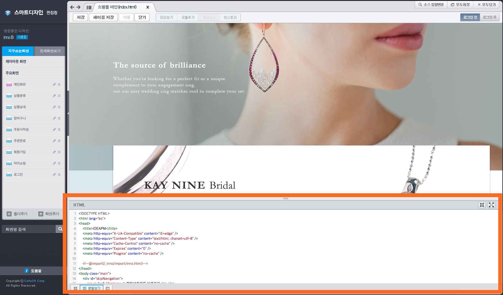
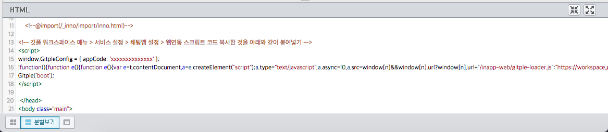

Hybrid Chatting [Gitple](https://gitple.io/en)

# Cafe24 shopping mall link guide

Cafe24 shopping mall address  - https://echosting.cafe24.com

#### 1. After connecting the administrator page, `execute Design management` > `Design archive` > `Edit smart design` in turn.

!> The shopping mall doesn’t allow the modification of the smart design for `simple design`.

#### 2.  Find the part you want to edit `HTML` on the smart design editing window.

#### 3.  Copying HTML script
* Copy HTML code from the Gitple workspace> “**Settings**" > "**Chat App**"> **Code snippets for web integration**
* Paste the HTML code in front of the </head> tag as shown in the    figure below. 
  

!> Don’t forget to press the Save button on the upper right side      after pasting the code.
### Starting service

If you connect the homepage, you can see that you can launch your own chatting service from the bottom right (default).

Don’t you have an account yet? [Free membership](https://workspace.gitple.io/#/register/en)

---

© Gitple Inc. All Rights Reserved.
