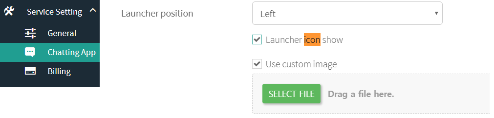

Hybrid Chatting [Gitple](https://gitple.io/en)

## My chat icon

This section explains how to create your own icon instead of the default icon.

Select the “Use the custom icon” check box in the "**Settings > Chat App**” menu of the workspace in the following screen.




If you have uploaded the icon, click "**Save**”  at the bottom of the screen. Then, you can check it on the actual linking site (or, chat App test menu).

#### Default icon


#### Custom icon example 1 


#### Custom icon example 2 


?> If you want more  diverse effects, refer to the following `Tip`..

### Tip-1
##### To make the image in question look `three-dimensional`, add the three-dimensional CSS attribute to the image itself as shown below.

```css
/* Adding CSS attributes to the custom icon  */
#gitple-launcher-custom-icon {
   border-radius: 30px;
   box-shadow: rgba(0, 0, 0, 0.1) 6px 12px 12px;
}
```

### Tip-2
##### Add CSS attributes as follows in order to apply `transparency` to the chat icon or to change  

```css
  /**
   * Example of adding transparency only to the icon in the Red theme  
   */

  /* Adding transparency to the icon that opens the chat App when it is closed */
  #gitple-launcher-icon.gitple-open {
    background-color: rgba(245, 63, 63, 0.5) !important;
  }
  /* Adding transparency to the icon that closes the chat App when it is opened. */
  #gitple-launcher-icon.gitple-close {
    background-color: rgba(86, 86, 86, 0.5) !important;
  }
  /* Adding transparency to tooltips  */
  #gitple-launcher-tooltip {
    background-color: rgba(245, 63, 63, 0.5) !important;
  }
```


<br>
[Back to tutorial page](en/tutorial.md)

---

© Gitple Inc. All Rights Reserved.
