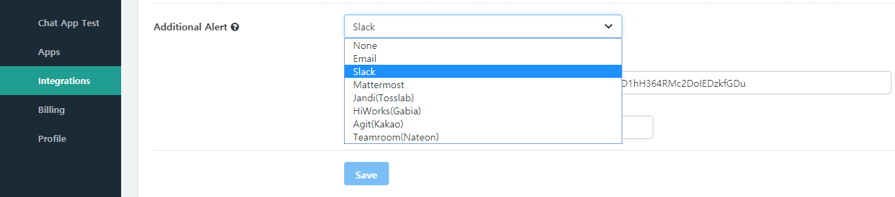
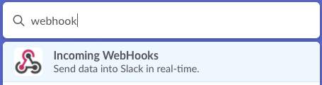
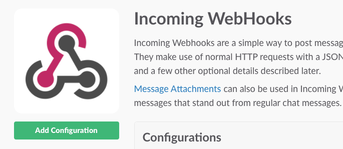
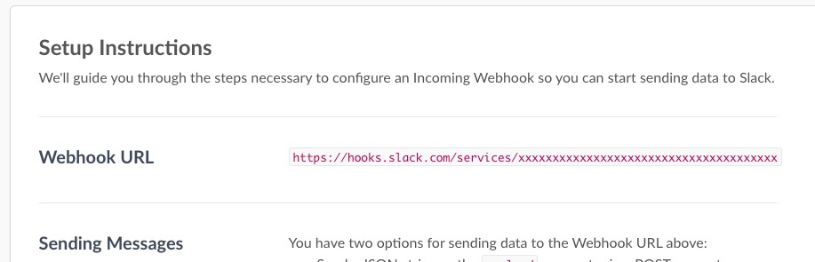
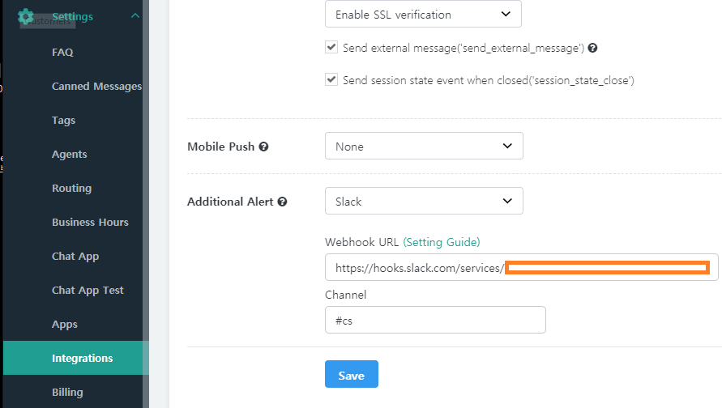

Hybrid Chatting [Gitple](https://gitple.io/en)

You can recognize your customer's inquiry by setting   "**Situation guide**" in "**Settings > Apps**” even though you don’t open the workspace and wait all the time.

Enables you to receive customer inquiry alert using the messenger you used to use in your company.

## Slack

  1. Connect and log in to the Slack site.

  2. Select **Incoming WebHooks** as follows.
    

  3. If you choose, you can enter  the **Add Configuration** menu that enables you to add a webhook as follows.
    

  4. Select a channel to receive notification and proceed with the following process to display the Webhook URL as follows.
    

  5. Input the URL in question and channel on the Gitple screen ("**Settings**" > "**Integrations**"> "**Additional Alert**")   and then, click the "**Save**” button.  
    

## Mattermost

Mattermost is very similar with Slack.

  1. In Mattermost, go to the left side drop-down Menu > Integrations

  2. Select 'Incoming Webhook'

  3. Click 'Add Incoming Webhook' button

  4. Fill in the input box and choose your desired channel then click 'Save' button.

  5. Then you will be given the webhook URL

  6. Copy and paste it on the Gitple workspace menu as shown above slack guide.

*The end of the current page.*

---

© Gitple Inc. All Rights Reserved.
