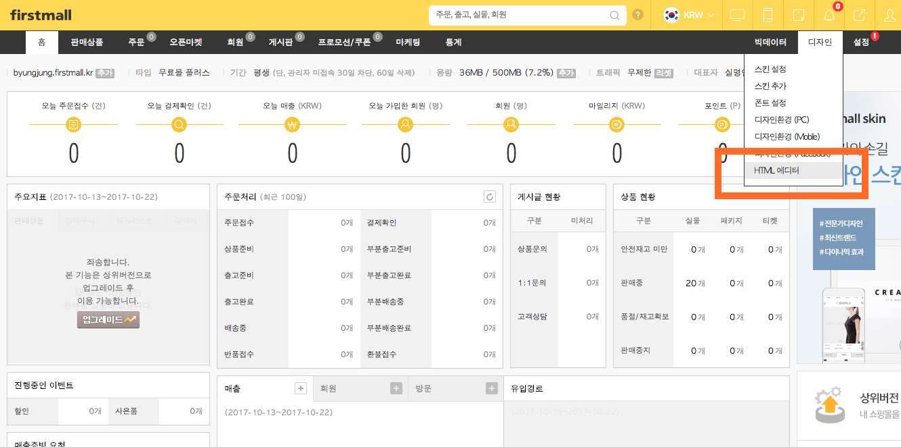
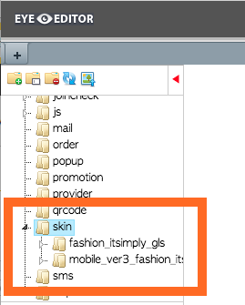
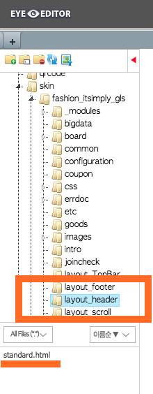
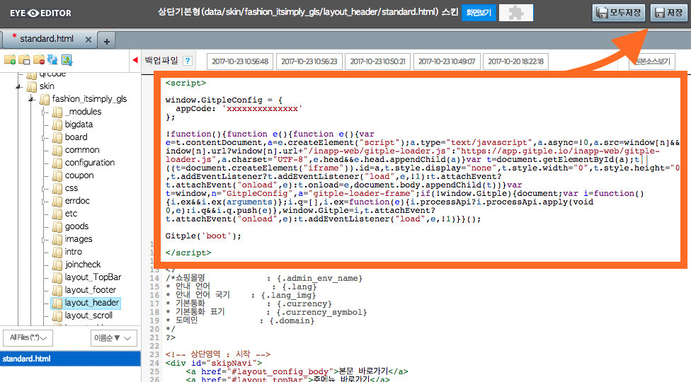
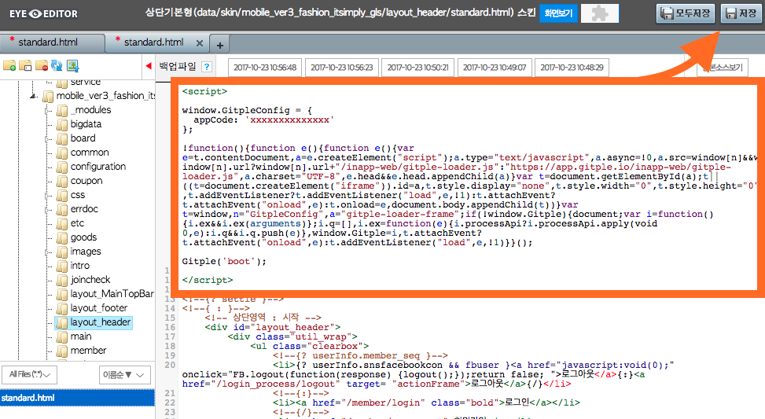
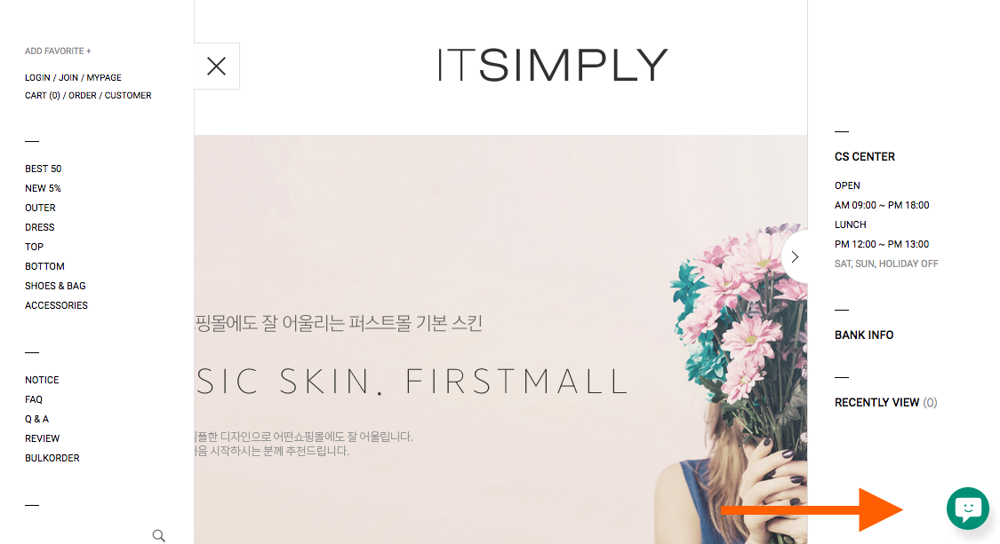

Hybrid Chatting [Gitple](https://gitple.io/en)

# Firstmall link guide

Firstmall address - http://www.firstmall.kr/

#### 1.  Connect as an administrator and click on the `Design` menu on the right side of the site to execute the `HTML editor`.

#### 2.  Find the `skin` folder on the opened editor window as shown below.

The number of folders and the name may differ depending on the use environment.

#### 3. Open the `standard.hml` file in the `layout_header` folder for each folder.

Double click the standard.html section below (if you have selected the folder).

#### 4.  Copying HTML script
* Copy HTML code from the Gitple workspace> “**Settings**" > "**Chat App**"> “**Code snippets for web integration**” attribute.
* Paste the HTML code at the beginning of the “standard.html” file that is opened.

Apply to all folders as shown in the following examples.

First folder example)

Second folder example)

!> Don’t forget to press the `Save` button on the upper right side after pasting the code.

### Starting service

If you connect the homepage, you can see that you can launch your own chatting service from the bottom right (default).

PC example)

Mobile example)

Don’t you have an account yet? [Free membership](https://workspace.gitple.io/#/register/en)

---

© Gitple Inc. All Rights Reserved.
