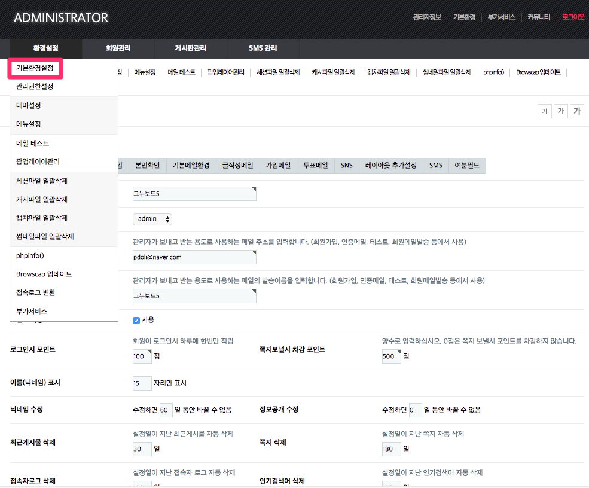
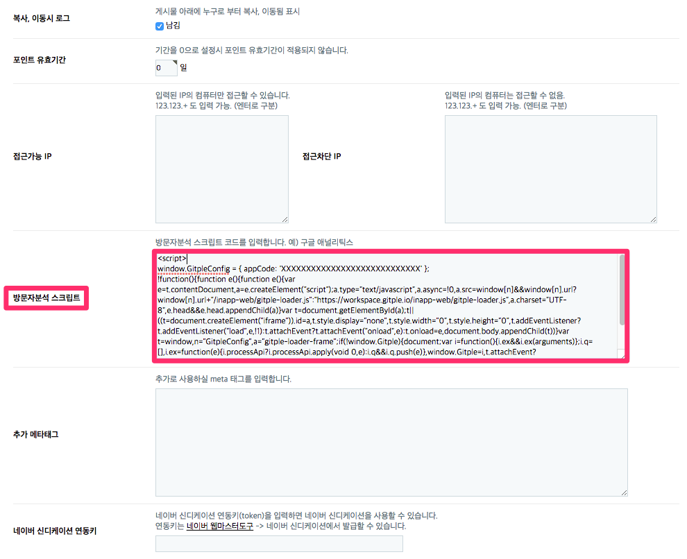
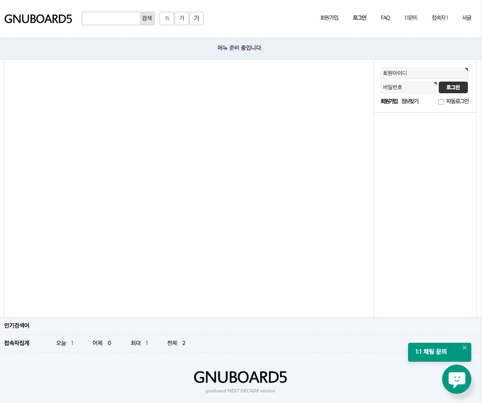

Hybrid Chatting [Gitple](https://gitple.io/en)

# GnuBoard5 link guide

- What is GnuBoard? - https://sir.kr/manual/g5/1
- Installing GNUBoards5  - https://sir.kr/manual/g5/2

#### 1.  After logging in as an administrator, execute `Administrator mode` > `Environment setting` > `Basic configuration` in turn.



#### 2.  Copying HTML script
* Copy HTML code from the Gitple workspace> “**Settings > Chat App**"> “Code snippets for web integration ” attribute.
* Find the "Visitor analysis script" section on the basic configuration screen of GNUBoard and paste the HTML code as shown below.
  

### Starting service

If you connect the homepage, you can see that you can launch your own chatting service from the bottom right (default).




### How to link the log-in user

[tail.php](https://github.com/gnuboard/gnuboard5/blob/master/theme/basic/tail.php)
Find a comment saying “End of the bottom” among script comments in the 'tail.php' file as shown below.
Then, insert the beginning of the Gitple plug-in example.

```php
if ($config['cf_analytics']) {
    echo $config['cf_analytics'];
}
?>

<!-- } End of the bottom  -->

<!-- Beginning of the Gitple log-in example { -->
<script>
<?php
if ($is_member) {
    $unique_id = $member['mb_id']; // Please change it to a UUID (lowercase), a number, etc. that can not be guessed for security reasons.
    $mb_id = $member['mb_id'];
    $name = get_text($member['mb_name']);
    $nick = get_text($member['mb_nick']);
    $email = $member['mb_email'];
    printf("
    Gitple('update', {
        id: '%s',
        name: '%s',
        email: '%s',
        meta: {
            '아이디': '%s',
            '별명': '%s'
        }
    });", $unique_id, $name, $email, $mb_id, $nick);
}
?>
</script>
<!-- End of the Gitple log-in example { -->

```

  * However, change $unique_id to a UUID (lowercase), a number, etc. that cannot be guessed for security reasons.
  * •	You can add the required value to the meta data.
  * [•	Please refer to the Changing from a non log-in user to a log-in user guide.


Don’t you have an account yet? [Free membership](https://workspace.gitple.io/#/register/en)

---


© Gitple Inc. All Rights Reserved.
