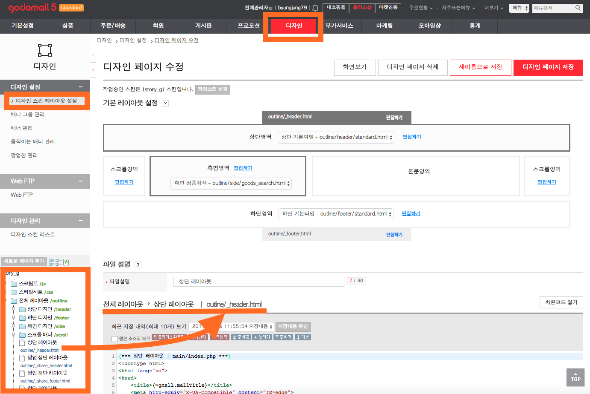
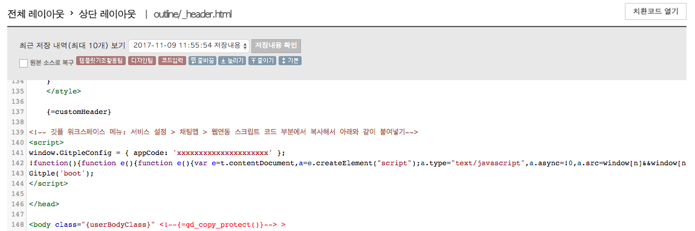

Hybrid Chatting [Gitple](https://gitple.io/en)

# Godo link guide

Godo mall address - http://www.godo.co.kr/

#### 1. After accessing the administrator page, select `Design` > `Design skin layout settings` > `outline / _header.html`.

#### 2. Copying HTML script
* Copy HTML code from the Gitple workspace> “**Settings > Chat App**"> “Code snippets for web integration” attribute.
* Paste the HTML code in front of the </head> tag as shown in the figure below.

!> Don’t forget to press the "**Save**" button on the upper right side after pasting the code.

### Starting service

If you connect the homepage, you can see that you can launch your own chatting service from the bottom right (default).

Don’t you have an account yet? [Free membership](https://workspace.gitple.io/#/register/en)

---

© Gitple Inc. All Rights Reserved.
