Hybrid chat [Gitple](https://gitple.io/en)

# Guide to applying Chatting App styles

A guide to change the style of your chatting App.

You can run an application test using the `Chrome browser developer` tool before applying the style to the actual service.

## Applying the changed style to the chat App

### 1. Connecting the workspace

After logging in to the workspace, select the “**Settings > Chat App**” menu.

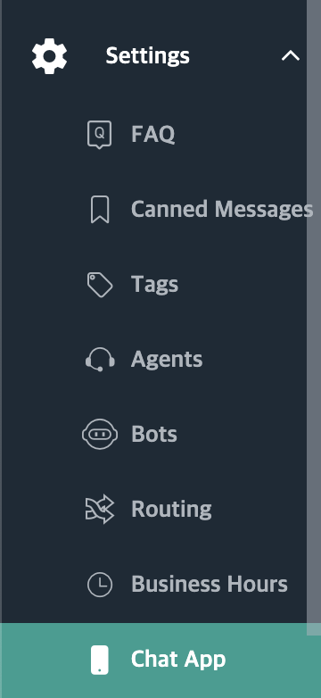

### 2. Adding Custom CSS

Add `gitple_custom.css` to CSS after setting “Custom CSS” attribute to `enable` in the “Chatting App” menu.

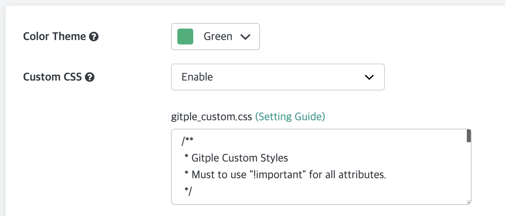

### 3. Save settings

 Press the "**Save**" button to save modified settings.

## Style change test in chatting App

### 1.  Running a chatting App test in the workspace

Run the chatting App by selecting the “**Chatting App test**” menu after logging in to the workspace.

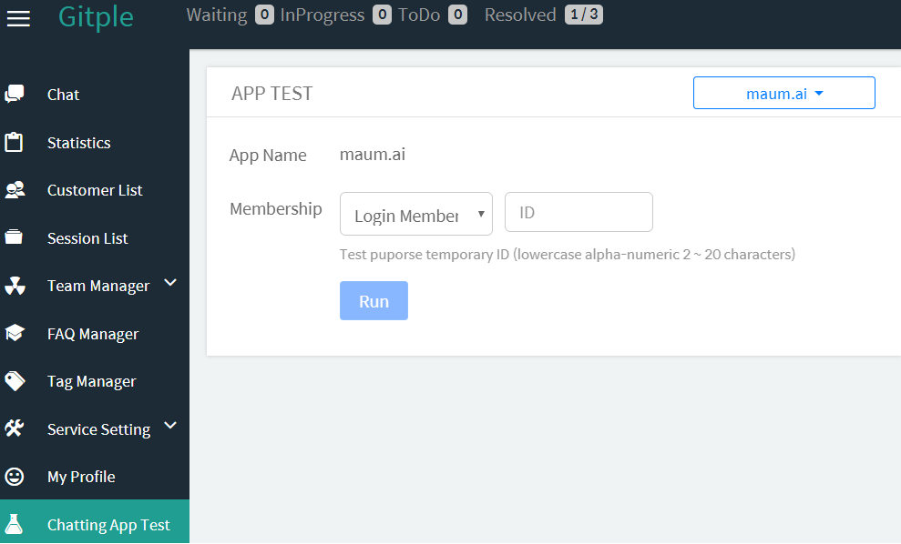


### 2. Executing developer tools

When the chatting App launches, right-click "**Test**" to execute developer tools.

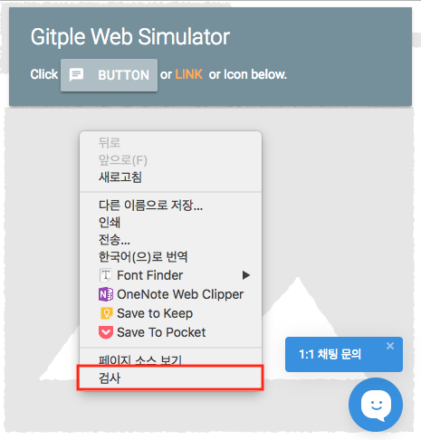


### 3. Opening the gitple_custom.css source code

Select `Open file` from the `Sources` menu on top of the executed developer tool.


Then, input `gitple_custom.css` to open the file.

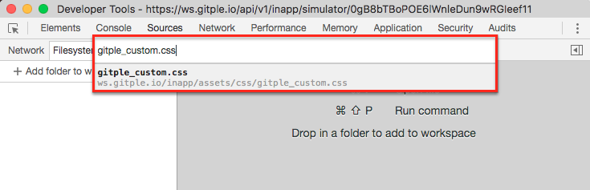


### 4.  Applying the style

If you add the required attribute values to each CSS class in the open source file, it will be applied to the `chatting App` immediately.

Make sure to add the `! important` attributes to the attributes you add, in order to reflect the actual value. And, if you add a class other than the one defined in `gitple_custom.css`, the style can be changed to an unintended style.  Please note.

- Example of changing the header value.

```css
  .gp-header {
    background-color: #3F69AA !important;
  }

  .gp-header-title {
    font-size: 18px !important;
    color: #fff !important;
    text-align: center;
  }

  .gp-close-btn,
  .gp-menu-btn {
    color: #fff !important;
  }
```

## CSS class description

### Header

|   |            | CSS Class  |
|---|:-----------|:-----------|
| 1 | Header      | .gp-header |
| 2 | Title Text  | .gp-header-title |
| 3 | Back Button | .gp-close-btn-container .gp-close-btn |
| 4 | Menu Button | .gp-menu-btn-container .gp-menu-btn |

<kbd style="padding: 0; margin: 0; border: none;">
  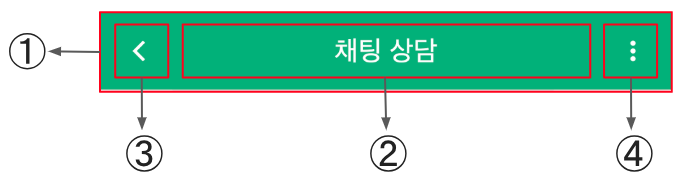
</kbd>

  1) Background

```css
  .gp-header {
    background-color: #fff !important;
  }
```

  2) Title

```css
  .gp-header-title {
    font-size: 18px !important;
    color: #495057 !important;
  }
```

  3) Back, Menu Icon

- Button color

```css
  .gp-menu-btn {
    color: #495057 !important;
  }
  .gp-close-btn {
    color: #495057 !important;
  }
```

- Button style

```css
  .gp-menu-btn::before {
    content: '\f1c3' !important;
  }

  .gp-close-btn::before {
    content: '\f2c0' !important;
  }
```

  [Ionicons Reference](https://cdn.rawgit.com/driftyco/ionicons/3.0/cheatsheet.html)

- Menu position: menu at left side, close at right side

```css
  .gp-menu-btn-container {
    left: 0 !important;
    right: auto !important;
  }
  .gp-close-btn-container {
    right: 0 !important;
    left: auto !important;
  }
```

### Home

|   |                             | CSS Class |
|---|:----------------------------|:----------|
| 1 | Header                      | .gp-header |
| 2 | Home body                   | .gp-home-body |
| 3 | Home intro title            | .gp-home-intro-title |
| 4 | Home intro title content    | .gp-home-intro-title-content |
| 5 | Home intro                  | .gp-home-intro |
| 6 | Home intro content          | .gp-home-intro-content |
| 7 | Home start button container | .gp-home-start-container |
| 8 | Home start button           | .gp-home-start-btn |

<kbd style="padding: 0; margin: 0; border: none;">
  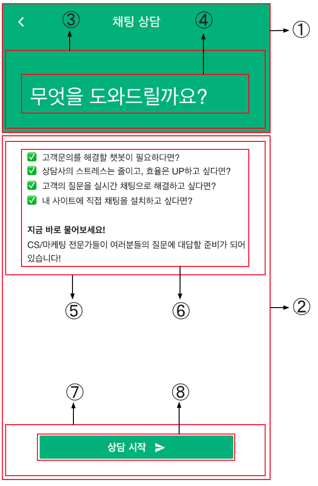
</kbd>


#### 1. Header

```css
  .gp-header {
    background-color: #3F69AA !important;
  }
```

#### 2. Body

```css
  .gp-home-body {
    background-color: #f8f9fa !important;
  }
```

#### 3. Intro

```css
  .gp-home-intro-title-content {
    color: #fff !important;
    font-size: 30px !important;
  }

  .gp-home-intro-content {
    color: #333 !important;
  }
```

#### 4. Start Button

```css
  .gp-home-start-btn {
    background-color: #3F69AA !important;
    color: #fff !important;
    font-size: 20px !important;
  }
```

### Chat

|   |                        | CSS Class |
|---|:-------------------------|:----------|
| 1 | Chat Background          | .gp-chat-body |
| 2 | Agent/Bot/System Message | .gp-chat-msg-other .gp-chat-text |
| 3 | User message             | .gp-chat-msg-mine .gp-chat-text |
| 4 | Bot/System Image         | .gp-chat-msg-bot-image <br>.gp-chat-msg-sys-image   |
| 5 | Agent Image              | .gp-chat-msg-agent-image |
| 6 | Message Time             | .gp-chat-msg-time |


<kbd style="padding: 0; margin: 0; border: none;">
  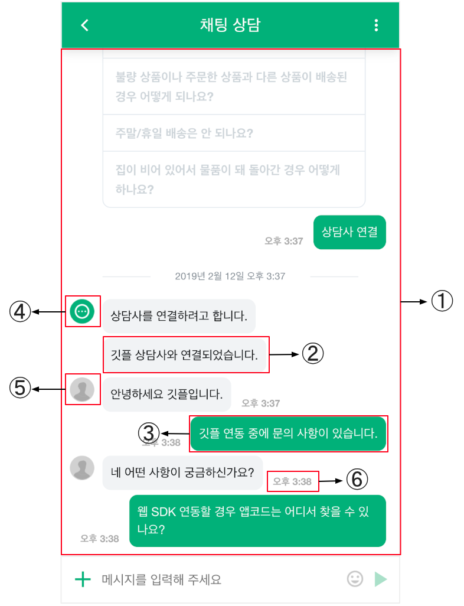
</kbd>


#### 1. Chatting Background

```css
  .gp-chat-body {
    background-color: #f8f9fa !important;
  }
```

#### 2. Agent/Bot/System message

```css
  .gp-chat-msg-other .gp-chat-text {
    background-color: #fff !important;
    border-radius: 4px !important;
    border: solid 1px #e5e9f1 !important;
  }
```

#### 3. User message

```css
  .gp-chat-msg-mine .gp-chat-text {
    background-color: #092957 !important;
    color: #fff !important;
    border: 0px !important;
    font-weight: bold;
    border-radius: 4px !important;
  }
```

#### 4. Bot/Agent profile image

```css
  /* Bot, System */
  .gp-chat-msg-sys-image, .gp-chat-msg-bot-image {
    background-image: url(https://cdn2.iconfinder.com/data/icons/business-set-2/512/Icon_11-512.png) !important;
  }

  /* Agent */
  .gp-chat-msg-agent-image {
    background-image: url(https://hostingfacts.com/wp-content/uploads/2015/09/customer-support.png) !important;
  }
```

#### 5. Message time


```css
  /* Overall */
  .gp-chat-msg-time {
    color: orange !important;
  }
  /* Bot/Agent specific */ 
  .gp-chat-msg-other .gp-chat-msg-time {
    color: red !important;
  }
  /* User specific */ 
  .gp-chat-msg-mine .gp-chat-msg-time {
    color: blue !important;
  }
```

### Chat - Message

|    |                       | CSS Class |
|----|:----------------------|:----------|
| 1  | Text                  | .gp-chat-text |
| 2  | List                  | .gp-chat-obj-list |
| 3  | Form                  | .gp-chat-obj-form |
| 4  | Form label            | .gp-chat-obj-form-label |
| 5  | Form input            | .gp-chat-obj-form-input |
| 6  | Form textarea         | .gp-chat-obj-form-textarea |
| 7  | Button                | .gp-chat-obj-btn |
| 8  | Slide                 | .gp-chat-obj-slide |
| 9  | Suggestion container  | .gp-suggestion |
| 10 | Suggestion button     | .gp-chat-suggestion-btn |

<kbd style="padding: 0; margin: 0; border: none;">
  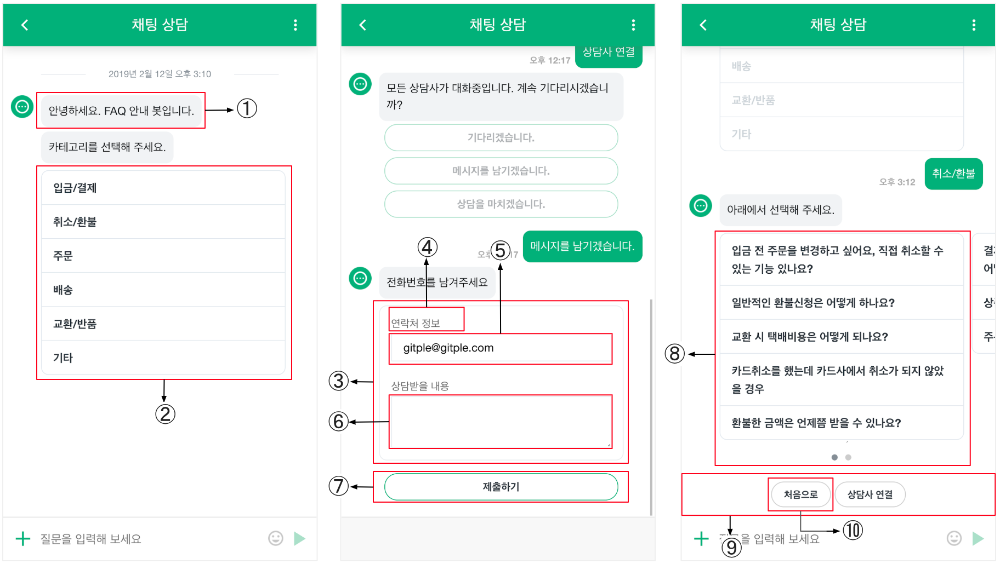
</kbd>


#### 1. Text

```css
  /* Bot/Agent */
  .gp-chat-msg-other .gp-chat-text {
    background-color: #fff !important;
    border-radius: 4px !important;
    border: solid 1px #e5e9f1 !important;
  }

  /* User */
  .gp-chat-msg-mine .gp-chat-text {
    background-color: #092957 !important;
    color: #fff !important;
    border: 0px !important;
    font-weight: bold;
    border-radius: 4px !important;
  }
```

#### 2. List

```css
  /* Change list message style */
  .gp-chat-obj-list {
    background-color: #eee !important;
    border-color: orange !important;
  }

  /* Change list message style when mouse over */
  .gp-chat-obj-list:hover {
    background-color: blue !important;
  }
```

#### 3. Form

```css
  /* Form */
  .gp-chat-obj-form {
    border-color: #3F69AA !important;
  }
  /* Form label */
  .gp-chat-obj-form-label {
    color: #000 !important;
    font-size: 18px !important;
  }
  /* Form input */
  .gp-chat-obj-form-input {
    border-color: #3F69AA !important;
    color: #000 !important;
  }
  /* Form textarea */
  .gp-chat-obj-form-textarea {
    border-color: #3F69AA !important;
    color: gray !important;
  }
```

#### 4. Button

```css
  /* Change button style */
  .gp-chat-obj-btn {
    font-size: 14px !important;
    background-color: #3F69AA !important;
    border: none !important;
    color: #fff !important;
  }

  /* Change button style when mouse over */
  .gp-chat-obj-btn:hover {
    background-color: blue !important;
  }
```

#### 5. Suggestion

```css
  /* Change suggestion container background color */
  .gp-suggestion {
    background-color: #f8f9fa !important;
  }

  /* Change suggestion button style */
  .gp-chat-suggestion-btn {
    background-color: #3F69AA !important;
    color: #fff !important;
    border: none !important;
  }

  /* Change suggestion button style when mouse over */
  .gp-chat-suggestion-btn:hover {
    background-color: blue !important;
  }
```


### Chat Footer

#### Footer in chatting

|   |                     | CSS Class  |
|---|:--------------------|:-----------|
| 1 | Footer              | .gp-chat-footer |
| 2 | File upload icon    | .gp-chat-footer-file-icon |
| 3 | Message input       | .gp-chat-footer-input |
| 4 | Emoticon button     | .gp-chat-footer-emoticon-btn |
| 5 | Message send icon   | .gp-chat-footer-send-icon |

<kbd style="padding: 0; margin: 0; border: none;">
  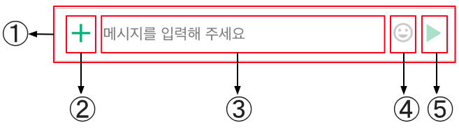
</kbd>

#### 1. Footer
```css
  .gp-chat-footer {
    background-color: #f8f9fa !important;
  }
```

#### 2. File upload icon

```css
  .gp-chat-footer-file-icon {
    color: #3F69AA !important;
  }
```

#### 3. Message input

```css
  .gp-chat-footer-input {
    background-color: #f8f9fa !important;
    color: orange !important;
  }
```

#### 4. Emoticon button

```css
  .gp-chat-footer-emoticon-btn {
    display: none !important;
  }
```

#### 5. Message send icon

```css
  .gp-chat-footer-send-icon {
    color: #3F69AA !important;
  }
```


#### Footer in closing chat

|   |             | CSS Class  |
|---|:------------|:-----------|
| 1 | Footer      | .gp-chat-footer-static |
| 2 | Button      | .gp-chat-footer-btn |

<kbd style="padding: 0; margin: 0; border: none;">
  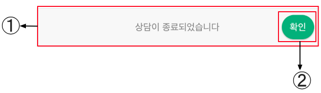
</kbd>

#### 1. Footer

```css
  .gp-chat-footer-static {
    background-color: lightgrey !important;
  }
```

#### 2. Button

```css
  .gp-chat-footer-btn {
    color: #fff !important;
    background-color: #3F69AA !important;
  }
```

### Anonymous Modal

|   |                     | CSS Class |
|---|:--------------------|:----------|
| 1 | Modal               | .gp-home-anonymous-modal |
| 2 | Modal Close Button  | .gp-home-anonymous-modal-close |
| 3 | Input Field Label   | .gp-home-anonymous-label |
| 4 | Input Field Input   | .gp-home-anonymous-input |
| 5 | Privacy Terms Text  | .gp-home-anonymous-privacy-terms |
| 6 | Login Button        | .gp-home-anonymous-btn |

<kbd style="padding: 0; margin: 0; border: none;">
  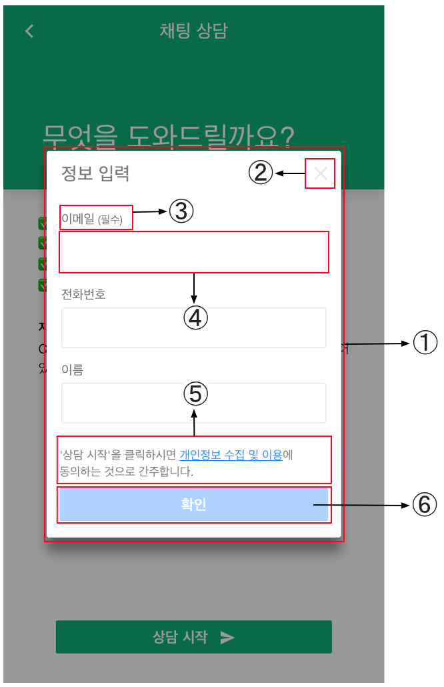
</kbd>

## gitple_custom.css example

<kbd style="padding: 0; margin: 0; display: inline-block;">
  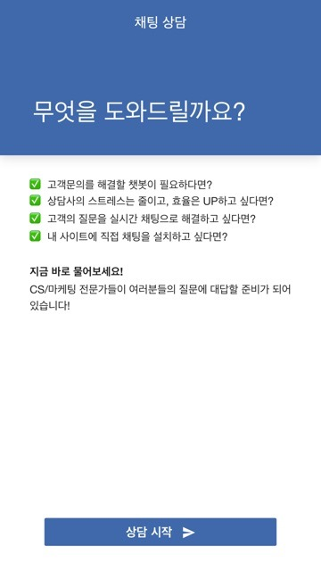
</kbd>
<kbd style="padding: 0; margin: 0; display: inline-block;">
  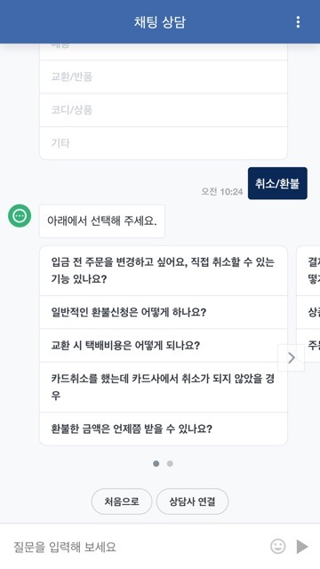
</kbd>

<!-- 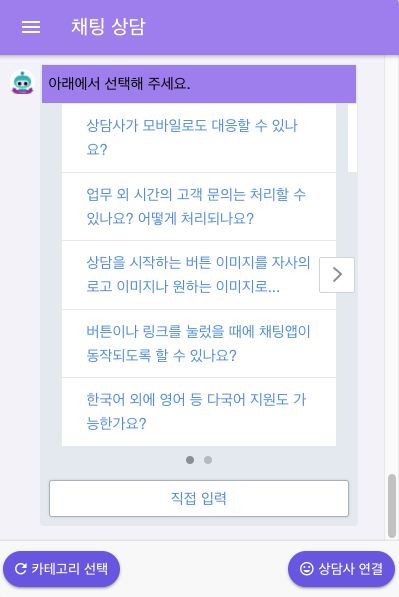 -->

```css
  /**
  * Gitple Custom Styles
  * Must to use "!important" for all attributes.
  */

  .gp-header {
    background-color: #3F69AA !important;
  }

  .gp-header-title {
    font-size: 18px !important;
    color: #fff !important;
    text-align: center;
  }

  .gp-close-btn,
  .gp-menu-btn {
    color: #fff !important;
  }

  .gp-home-intro-title {
    color: #fff !important;
  }

  .gp-home-start-btn {
    background-color: #3F69AA !important;
  }

  /* chat page: body */
  .gp-chat-body {
    background-color: #f8f9fa !important;
  }

  /* chat page: message box for user */
  .gp-chat-msg-mine .gp-chat-text {
    background-color: #092957 !important;
    color: #fff !important;
    border: 0px !important;
    font-weight: bold;
    border-radius: 4px !important;
  }

  .gp-chat-msg-other .gp-chat-text {
     background-color: #fff !important;
    border-radius: 4px !important;
    border: solid 1px #e5e9f1 !important;
  }

  .gp-chat-msg-emoticon {
    background-color: transparent !important;
  }

  .gp-chat-msg-emoticon .gp-chat-obj {
    background-color: transparent !important;
  }


  /* chat page: message box for object list */
  .gp-chat-obj-list {
    font-size: 14px !important;
  }

  /* chat page: message box for object button */
  .gp-chat-obj-btn {
    font-size: 14px !important;
    background-color: #3F69AA !important;
    border: none !important;
    color: #fff !important;
  }

  .gp-suggestion {
     background-color: #f8f9fa !important;
  }

  .gp-chat-footer-file-icon {
    color: #333333 !important;
  }

  .gp-chat-footer-send-icon {
    color: #333333 !important;
  }

  .gp-chat-footer-btn {
    color: #fff !important;
    background-color: #3F69AA !important;
  }
```


Don’t you have an account yet? [Free membership](https://workspace.gitple.io/#/register/en)

---

© Gitple Inc. All Rights Reserved.
