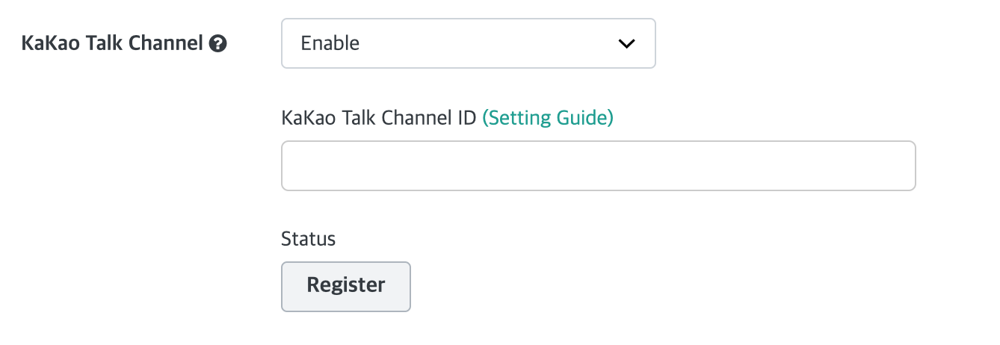

Hybrid Chatting [Gitple](https://gitple.io/en)

# KakaoTalk channel

KakaoTalk channel only supports Korean.

In order to use KakaoTalk channel interworking, you need to register as well as join KakaoTalk Business Channel.

## KakaoTalk channel Signup

You can register on the [KakaoTalk Business Channel](https://accounts.kakao.com/login/kakaoforbusiness) site.

* Please register as a business!
* Please be sure to turn ON the business information> home exposure settings!

## Gitple Integration

1. Refer to KakaoTalk Channel Manager Center **`Administration> Detailed Settings> Search ID`**, and enter the corresponding value in the workspace **`Settings> Integration> KakaoTalk Channel ID`**.

2. Please **`Register`** button.

    

    * KakaoTalk Channel ID
      * Search ID set in the cacao channel.
    * The registration status is divided into `Receipt> Progress> Success` step. When the Success status is reached, Workspace consultation is available through KakaoTalk Chat.

3. After registration, you can contact us directly from the workspace by chat or email help@gitple.com.

---

© Gitple Inc. All Rights Reserved.
