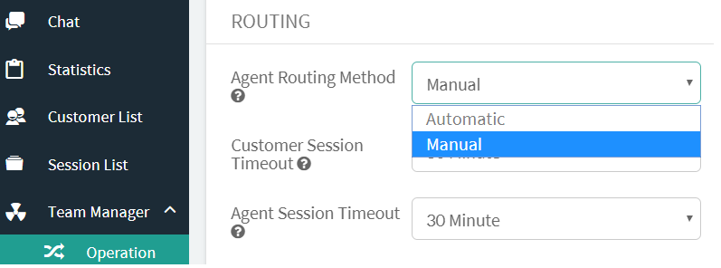
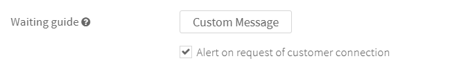
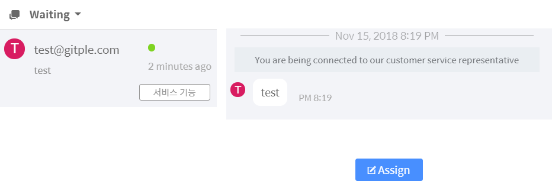
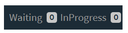

Hybrid Chatting [Gitple](https://gitple.io/en)

## Manual assignment

Manual assignment method is a way to put all chating into **Waiting** list because it is difficult for the agent to respond to the client's inquiry in real time.

It is convenient to use manual assignment in the following situations.
- There is a certain amount of client inquiries, but it is a burden to operate a dedicated agent.
- Customer inquiries are concentrated on a particular season. Therefore, a solution is required that can replace a dedicated agent.
- Although the service is not officially launched, it is needed to actively accept client inquiries 24 hours during the test period.
- You want to provide client service as if there is a professional agent in your office during your outside meeting.

#### How to set up
Manual assignment is as follows.

You can also receive alert when chatting is added to the waiting list. To receive alert, you need to activate the notification situation setting in [Situation guide](http://guide.gitple.io/#/en/howto?id=situation-guide).

#### How to assign agent

To assign the counselor to the counselor queue, click the `ReOpen` button on the right side of the `waiting` list of the workspace

Now chatting status goes to the `InProgress` list as shown below, and a customer can chat with an agent.

If you have any further questions, please click chatting icon and contact us.

!> If the number of chat increases and you need a dedicated agent [automatic assignment](en/autorouting.md)

 
[Back to tutorial page](en/tutorial.md)

---

© Gitple Inc. All Rights Reserved.
