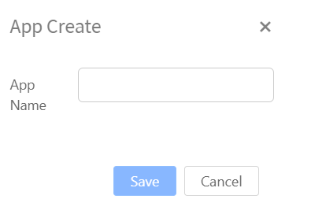
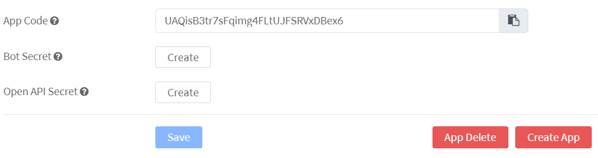
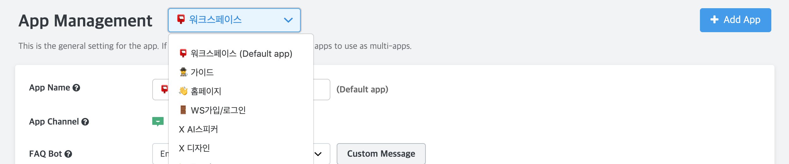
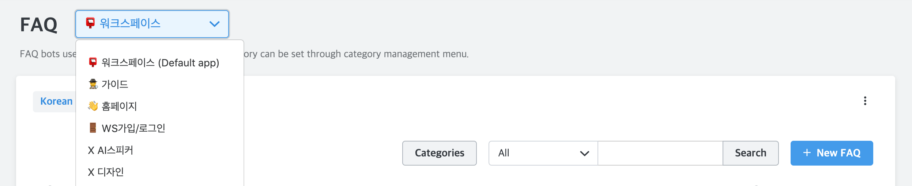

Hybrid Chatting [Gitple](https://gitple.io/en)

## Multi-App

?> A function to be able to classify consultation requests by user group, category and app and managed independently for each web and mobile app in one workspace.

* Use examples
  - If you have several homepages with different characteristics and need to set the FAQ data individually.
  - If end-customers use several languages (or regions) and you want to clearly distinguish them.
  - If you want to check the data separately for Android, iPhone App, etc., besides the homepage.
  

### Creating an App

  - You can find “Create App” as shown in the above figure, if you can check the bottom of "**Setting > Apps**".
  - When you run it, you can enter the name of the App you want as shown below.

      

### How to use multiple Apps

  

  * Once you create an App, you can see that the new **App code** has been issued as shown above.
  * You only have to apply the new **App code** wherever you want. 

  ?> From now on, it will be the basis of the individual App when setting the service. You can see the current App using the menu on the top right as shown below.

  

  * In addition, you can also check your Apps separately on other pages, if necessary.

  

---

© Gitple Inc. All Rights Reserved.
