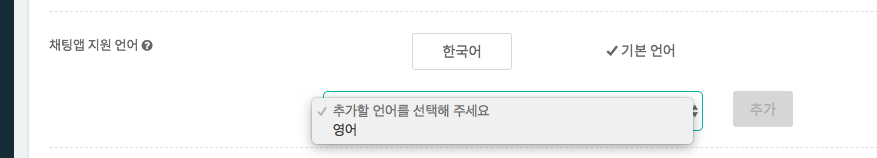
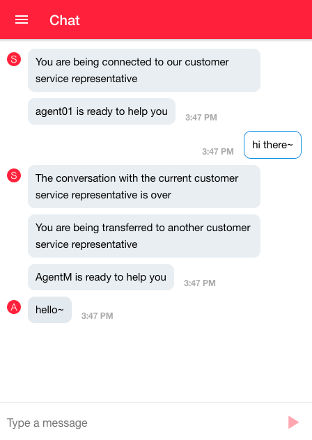
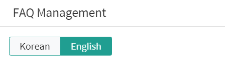
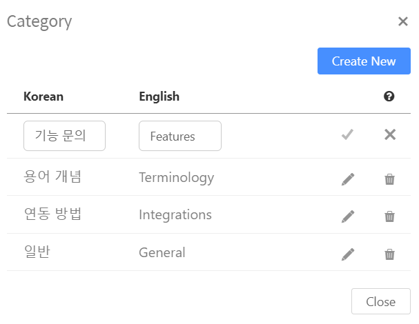
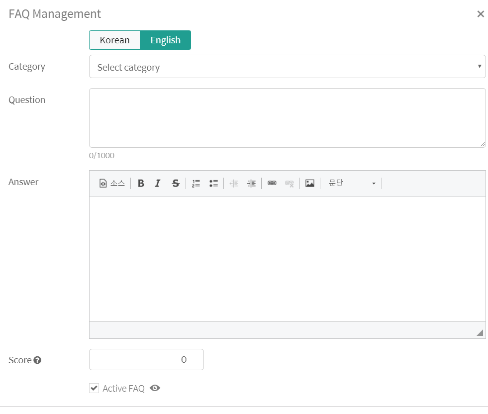
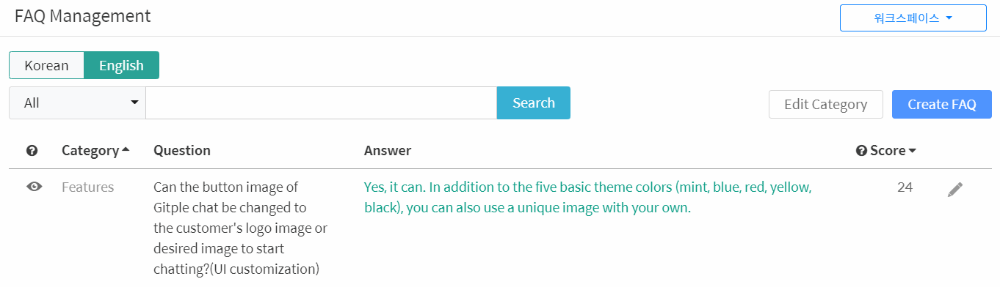
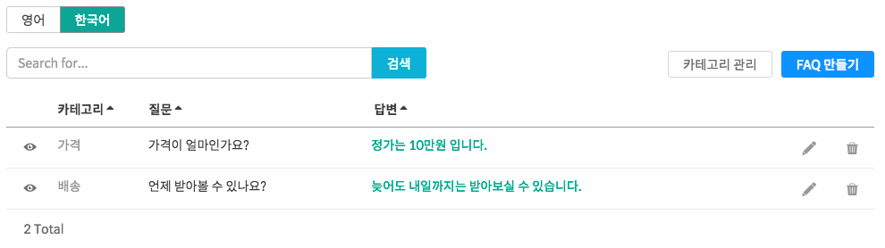
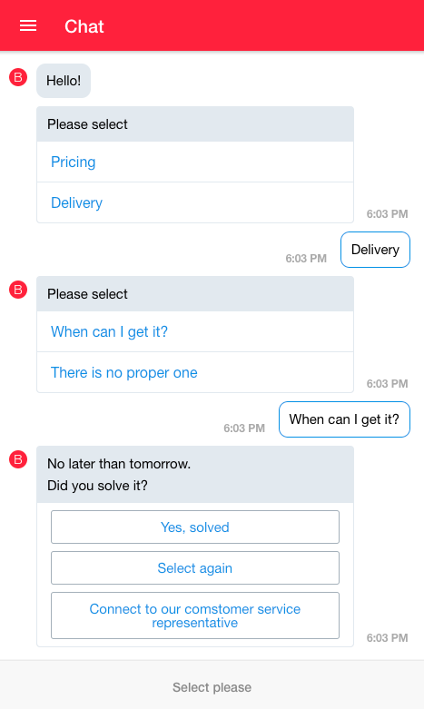
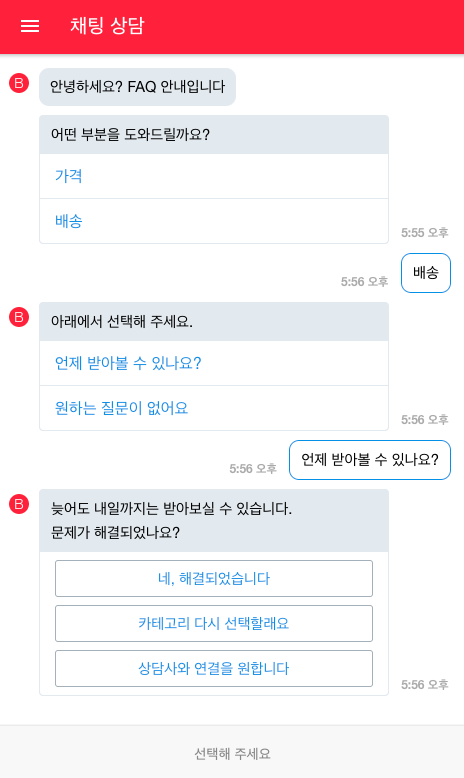

Hybrid Chatting [Gitple](https://gitple.io/en)

## Multilingual client support

Chatting apps currently support English, Chinese, and Japanese in addition to Korean.

?> The explanation assumes that English is an international language.

### 1. Change English to a default language

If English has not been added yet, Select “**Settings > App > Supported Languages > English**". 

If the default language is not English, set English as a default language. 

Check whether English is set to a default language as above.

### 2. Checking whether the chat App is running in English

* Check whether the default language of the chat App has been changed to English as above.
  - •	You can set multi-language such as the start-up message and tooltip information by selecting the workspace "**Settings > App >**” menu.

### 3. FAQ multilingual setting

First, make sure that the multi-language tab (English and Korean) is displayed in “FAQ management” as shown below.

Create a new category in **Edit Category**.

Create an item by language in **Create FAQ**.
  - Input the information in both English and Korean tab and save it
     

  - Let's try as shown in the example below.

| Language | Example |
|--------| -------|
| English |  | 
| Korean |  | 

### 4. Check operation

| English | Korean |
|--------| -------|
|  |  |

 
[Back to tutorial](en/tutorial.md)

---

© Gitple Inc. All Rights Reserved.
