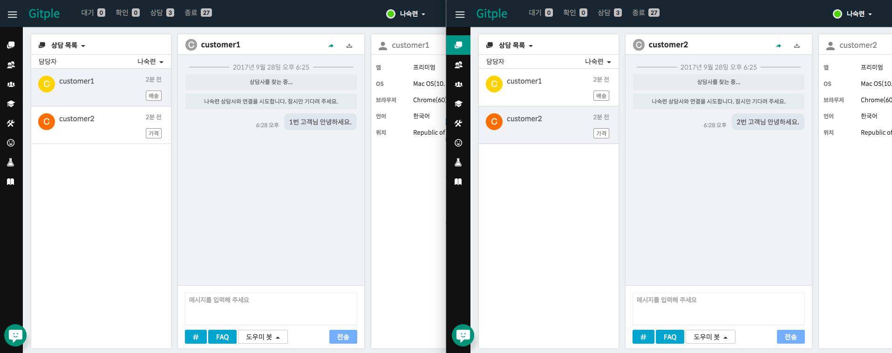

Hybrid Chatting [Gitple](https://gitple.io/en)

## Workspace multi-window

!> If you consult with several clients at the same time, be careful because you can make a mistake!
 
You can respond to several customers at the same time by running several workspaces as shown below. 
You can see that a agent chats with two customers at the below.

?> This feature can be used in a variety of ways depending on the agent's work style and monitoring environment.

 
[Back to the tutorial](en/tutorial.md)

---

© Gitple Inc. All Rights Reserved.
