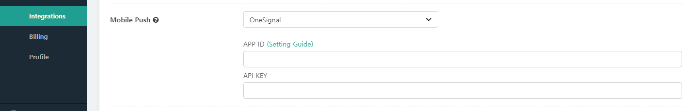
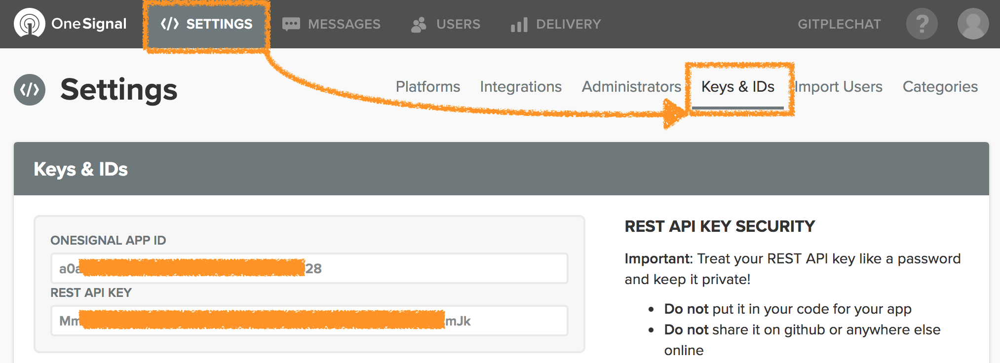

Hybrid Chatting [Gitple](https://gitple.io/en)

## Push SDK

?> A guide to link the mobile App with the push function. 

### OneSignal

[OneSignal](https://onesignal.com) provides a push SDK optimized for all mobile platforms. Gitple recommends this push solution by default, if the mobile App doesn’t have the built-in push function.

#### Workspace settings


  - You can check “push setting” in "**Settings > Integrations**” as shown in the above figure.
  - You can check the `App ID` and `API key` value WHEN You connect the OneSignal page as shown in the following figure.

  
  
  - Copy and paste the value in question and press the Save button at the bottom. That’s it.

#### Mobile App settings

- You have to **send the OneSignal Tag** after the code that initializes OneSignal.
  * key
    - gp
  * value
    - The ID to use when linking Gitple members (`Need to change to a string if the ID is a number`)
  * Android example

    ```OneSignal.sendTag("gp", "loginId");```
  * Reference document
    - [onesignal tag](https://github.com/OneSignal/react-native-onesignal#sending-and-getting-onesignal-tags)

- How to check whether the message was sent by `Gitple when you receive a push message`.
  * Check the following values in notification.payload.additionalData of the notification received event.

    ```{"from" : "gp"}```
  * Reference documents
    - [onesignal handling notification](https://github.com/OneSignal/react-native-onesignal#handling-notifications)
    - [onesignal notification data](https://documentation.onesignal.com/reference#section-attachments)

?> Below is the additional information.

#### Option to show notifications when the App is in foreground in OneSignal

##### Android

Setting the 'setInFocusDisplaying' method

  - Notification: Displays default notification even when the App is in focus.
  - InAppAlert (default): Displays an alert message when the App is in focus.
  - None: Don’t display notification when the App is in focus.

```
// Example of adding to the OneSignal initialization code
OneSignal.setInFocusDisplaying(OneSignal.OSInFocusDisplayOption.Notification);
```

  Reference link: https://documentation.onesignal.com/docs/android-native-sdk#section--setinfocusdisplaying-

##### iOS

Objective-C option
OSNotificationDisplayTypeNotification - Native notification display
OSNotificationDisplayTypeInAppAlert (DEFAULT) - Alert dialog display.
OSNotificationDisplayTypeNone - Notification is silent and not shown

Swift option:
OSNotificationDisplayType.notification
OSNotificationDisplayType.inAppAlert
OSNotificationDisplayType.none

```
// Example of setting in Swift
OneSignal.inFocusDisplayType = OSNotificationDisplayType.notification
```

```
// // Example of setting in Objective-C
OneSignal.inFocusDisplayType = OSNotificationDisplayTypeNotification;
```

Reference link : https://documentation.onesignal.com/docs/ios-native-sdk#section--infocusdisplaytype-


---

© Gitple Inc. All Rights Reserved.
