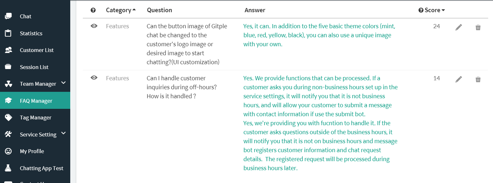
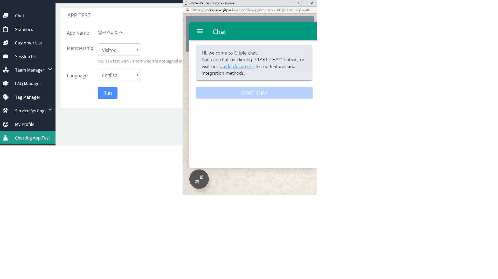
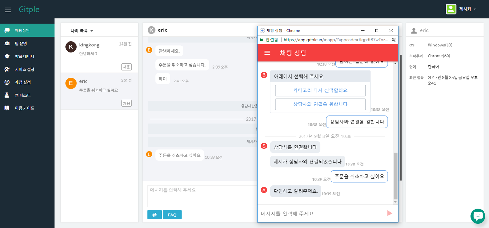
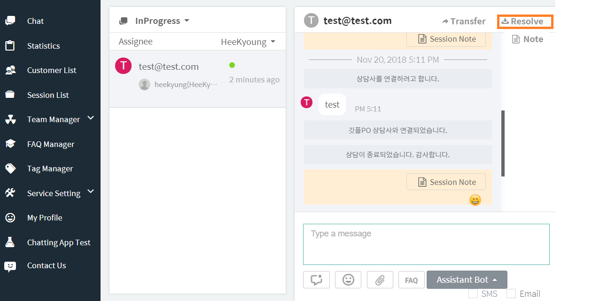

Hybrid Chatting [Gitple](https://gitple.io/en)

## Quick Start Guide

### 1. Workspace connection

?> Log in by connecting the **below link** using the ID and password you’ve received. If you don’t have an account?
   [Free sign-up](https://workspace.gitple.io/#/register/en)

#### https://workspace.gitple.io/

### 2. FAQ management

?> Create a FAQ category and enter your questions and answers accordingly. You can continue to modify and input the FAQ as you actually conduct chatting.

### 3. Chatting App test

?> Enter the test client ID and execute. Click the “Start chat” button to check if the FAQ information is provided correctly.

### 4. Connecting an agent

?> The inquiry details entered through the chatting App can be answered by an agent using the “**Chat**” menu.

### 5. End chatting

?> Process ending chat when chatting is over.

 
[Back to the tutorial](en/tutorial.md)

---

© Gitple Inc. All Rights Reserved.
