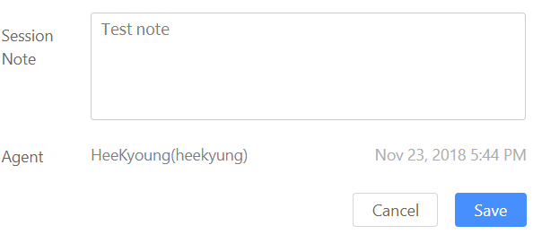
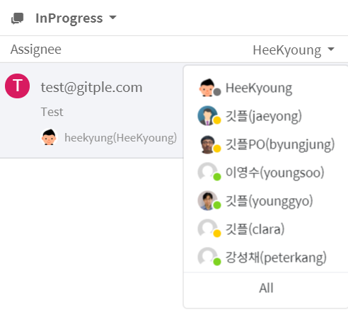
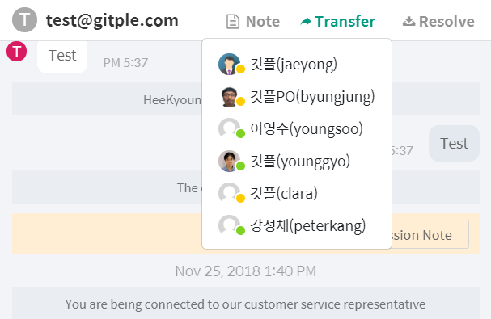

Hybrid Chatting [Gitple](https://gitple.io/en)

## Joint name of agents

If you have decided on a name to use jointly,

all agents can change their `name` on the **profile** page.

?> Even if several agents use the same name as below, they can be distinguished internally because a **separate ID is specified in parentheses**.

| When checking the chat note |
|-------|
| |

| When selecting from the chat list | When changing agents |
|--------:---------:--------|
| | |

_The ID of the user is not displayed on the chat list so that the user can be easily identified._

 
[Back to the tutorial](en/tutorial.md)

---

© Gitple Inc. All Rights Reserved.
