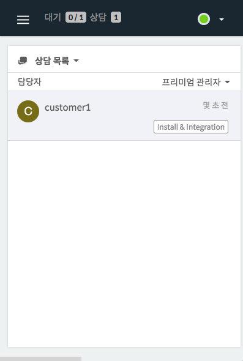
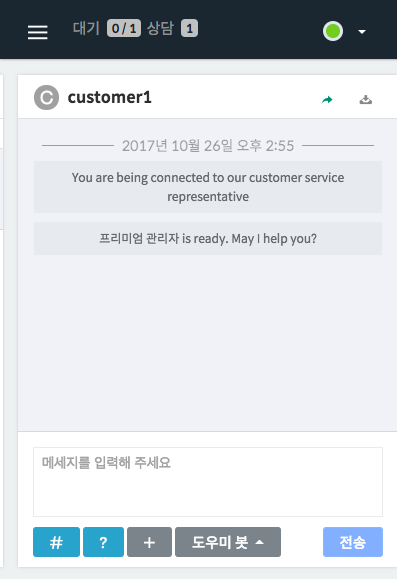

Hybrid Chatting [Gitple](https://gitple.io/en)

## Workspace auxiliary window

It is not a special function. But, try to reduce the size of browser window.
- Then, you can see that it is also optimized for the mobile screen size as shown below.
- Using this feature, you can perform your duty by putting the monitor aside.

| Chat list | chat room |
|-----------:---------|
| | |

?> If you select a room on the chat list, the chat room screen will be **displayed automatically**.

!> Does the menu not disappear?  Press the three-line menu on the left upper side of the workspace.

 
[Back to the tutorial](en/tutorial.md)

---

© Gitple Inc. All Rights Reserved.
