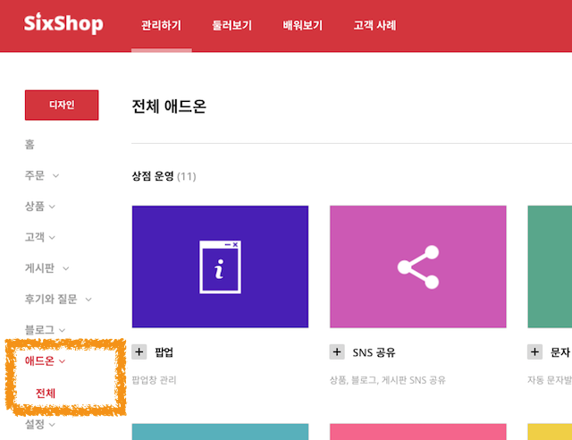
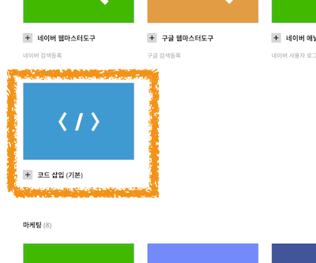
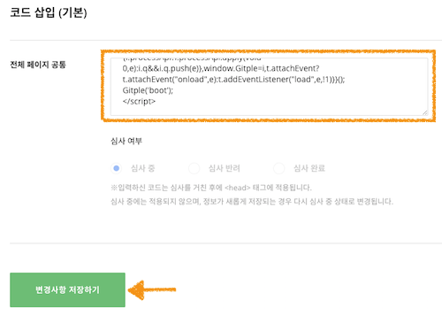

Hybrid Chatting [Gitple](https://gitple.io/en)

# Sixshop link guide

Sixshop address - https://www.sixshop.com

#### 1. After connecting the administrator page, select `Design > Add-ons`.

#### 2. Find and select the `Insert code` add-on as follows.

#### 3. Copying HTML script
* Copy HTML code from the Gitple workspace> “**Settings > Chat App**"> “Code snippets for web integration” attribute.
* Paste the HTML code into the input window as shown in the following figure.
  

!> After pasting, select `Save changes`.

### Starting service

Currently, you can use the chat service after screening, because the code to be inserted into Sixshop is reflected after screening.

(After completing screening) If you connect the homepage, you can see that you can launch your own chat consultation service from the bottom right (default).

Don’t you have an account yet? [ Free membership](https://workspace.gitple.io/#/register/en)

---

© Gitple Inc. All Rights Reserved.
