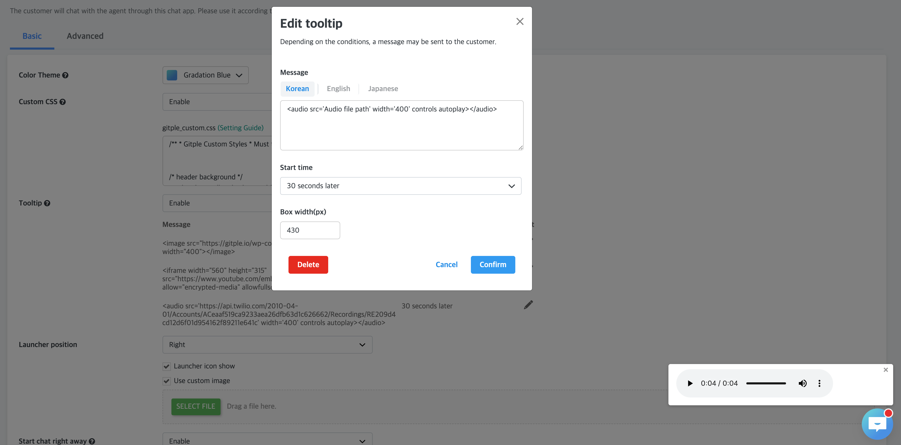

<style>
@media (max-width: 485px) {
    #tooltipShape {
        margin-left:0 !important;
        margin-top: 0 !important;
    }       
}

@media (max-width: 546px) {
    #tooltipShape {
        margin-left:0 !important;

    }
}
</style>

### Tooltip 

<span style="vertical-align:top">Message box settings at the top of the chat app icon</span> 

##### How to set the tooltip


1. `Settings` -> `Chat App` -> Changed `Disabled` to `Enabled` in the `Tooltip` field.

###### Settings screen


`Message` : Tooltip message content to be displayed on the chat app icon  
`Start time` : The setting value for how many seconds after the site is ** loaded ** the tooltip message is displayed.  
`Edit` : Edit modal popup for that message  
`Add` : Additional modal pop-ups for new messages - (Up to 3 can be added)  
`Box width(px)`**(Modal screen)** : Set tooltip width

###### Example tooltip scenario

**Settings screen**  


Each message ** Hello **, ** Nice to meet you **, ** Do you have any questions to inquire? **  
Those start time was set as shown above.

**Example screen**
<video height="100" loop autoplay muted src="/en/assets/images/tooltip/tooltipExample.mp4"></video>

**Add images, YouTube and audio**

You can add images, YouTube videos, and audio tracks inside the tooltip.

However, automatic playback is not supported.
- Image
  ```javascript
  <image src="Image file path" width="400" height="400"></image>
  ```
  
- YouTube
  ```javascript
  <iframe width="560" height="315" src="https://www.youtube.com/embed/pWemV6TiUZE" frameborder="0" allow="encrypted-media" allowfullscreen></iframe>
  ```
  
- Audio
  ```javascript
  <audio src='Audio file path' width='400' controls autoplay></audio>
  ```
  