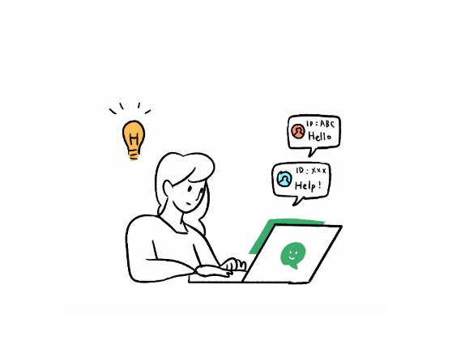
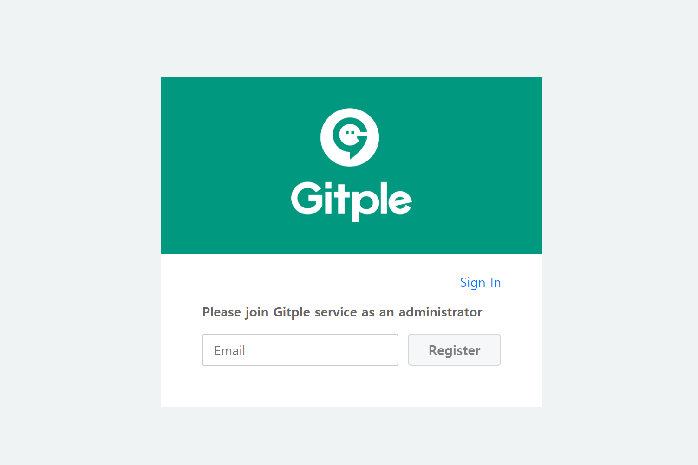
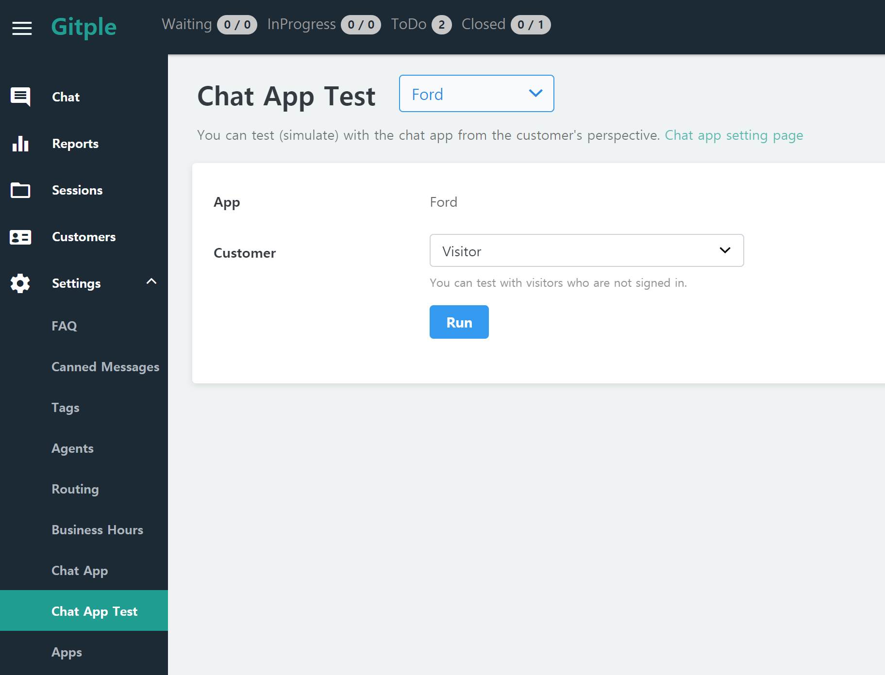
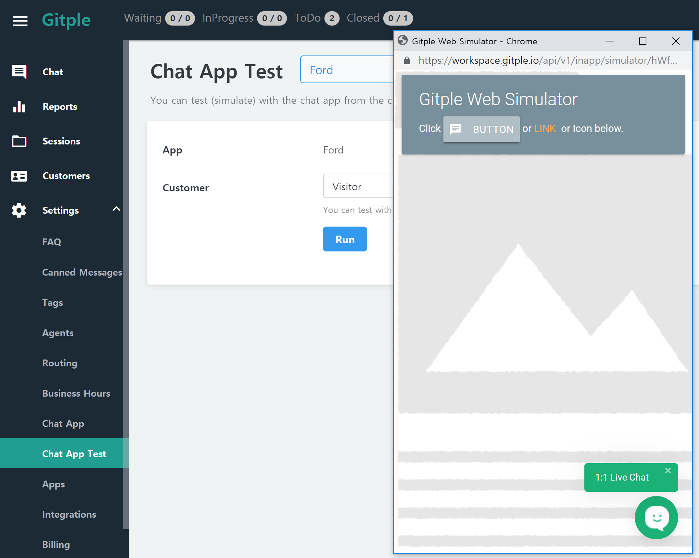
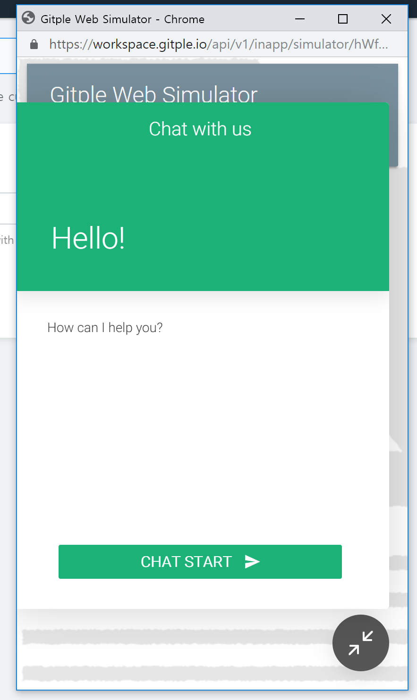
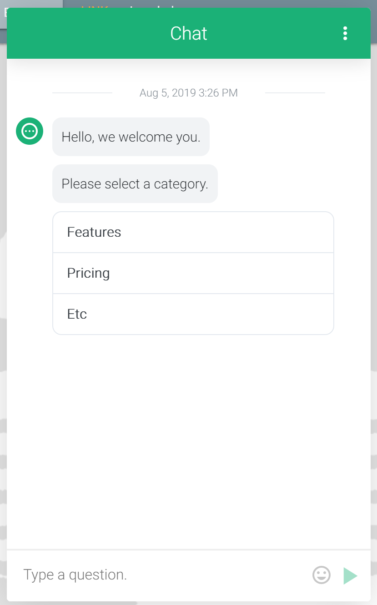
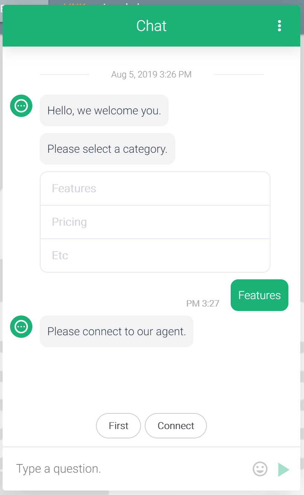
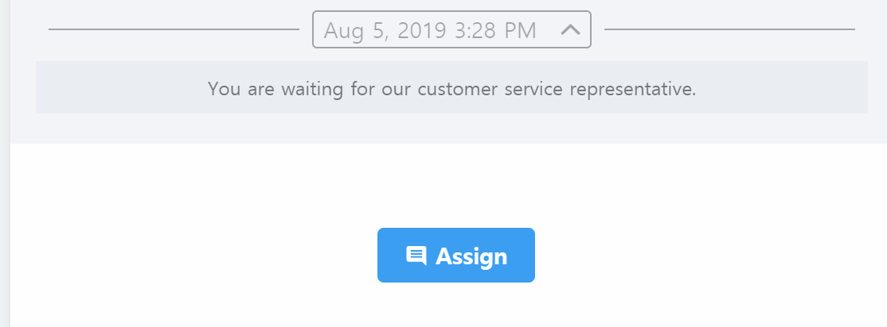
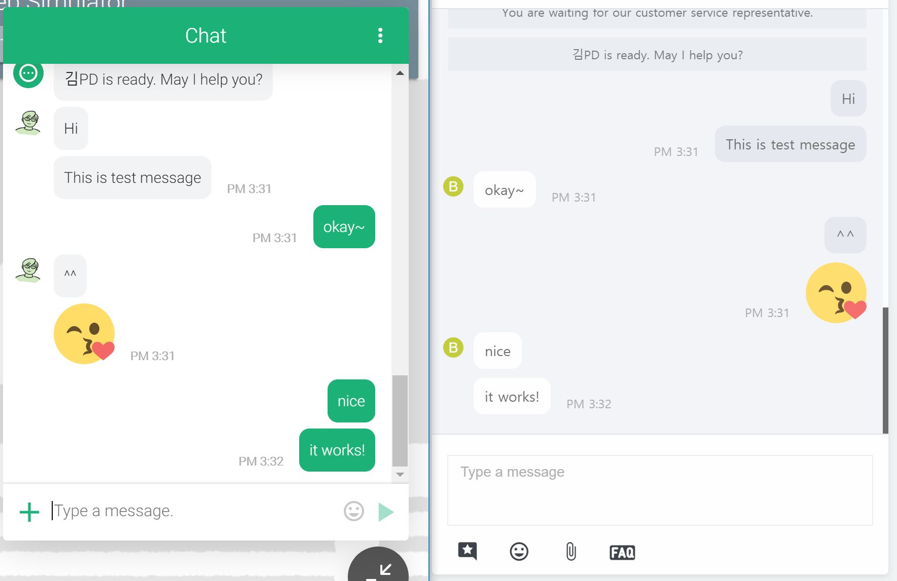

# Product Tour

Gitple is Customer Support Platform that can support the customer inquiry in real-time livechat. With this product tour guide, you can simulate livechat with your customers in real-time, test how to resolve customer inquiries, and complete a support session.

> Readers: Who wants to understand the product through testing before adopting Gitple.

### Contents

1. [Membership](#_1-Membership)
2. [Chats](#_2-Chats)
3. [Settings](#_3-Settings)
4. [Management](#_4-Management)

## 1. Membership

Sign In after signing up. (A valid email address is requried.)

## 2. Chats

> Here's how to communicate with your customer through the test menu before Gitple livechat app integration.

### 1) Chat Start

1. In the **Settings > Chat App Test** menu, click the Run button. ([Chat App Test Guide](https://guide.gitple.io/#/en/howto?id=settings-gt-chat-app-test))

    

2. Chat App Test Windows will be shown then execute the **Launcher Icon**(or Button, Link)

    

3. Click the **Chat Start** button.

    

4. The FAQ Bot set up by default will start a chat. As instructed in the guide, please select a category or question.

    

5. After select a category, the Agent Connection Button is activated. Click the **Connect** button.

    

6. Then you can see that the new customer chat has been placed on the waiting (or in-progress) list.

    

7. If the Customer Support Status Indicator **InProgress** does not show pending request, click the **Assign** to livechat. 

    

8. Now you can do livechat in real-time.

    

### 2) Chat InProgress

Communicate with customers like the other livechat messengers.

### 3) Chat Close

To complete the livechat, click the "End" on the upper right of the livechat window.
(There are also several situations to be closed such as user's end and timeout)

## 3. Settings

1. In the **Settings > Agents** menu, you can add new agents and agent group.([Agents Guide](https://guide.gitple.io/#/en/howto?id=settings-gt-agents))

2. In the **Settings > Business Hours** menu, you can set the business hours and holidays.([Business Hours Guide](https://guide.gitple.io/#/en/howto?id=settings-gt-business-hours))

3. In the **Settings > Apps** menu, you can set Bot message and so on.([Apps Guide](https://guide.gitple.io/#/en/howto?id=settings-gt-apps))

## 4. Management

1. With **Report** menu, you can continuously understand the flow of support.
2. With **Sessions** menu, you can check past support history and search with filters.
3. With **Customers** menu, you can see the data of the customer who initiated or left the support.

If you tested everything above, please see the [Chat App SDKs](https://guide.gitple.io/#/en/sdk-list) to integrate Gitple to your Web or App.

If you need additional help, please feel free to contact us!
