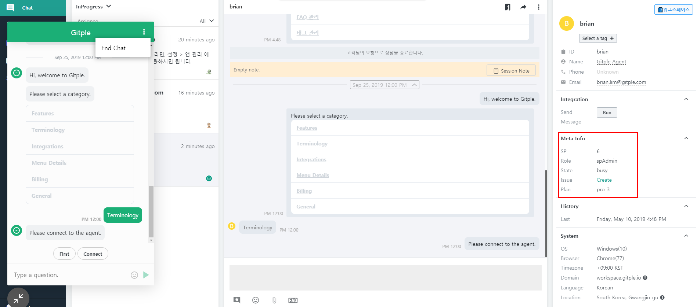

Hybrid Chating [Gutple](https://gitple.io/en)

# Homepage application guide

This section explains the procedure of linking the Gitple chat service to your homepage (web site or web App).

Just fill in the `appCode` part that is located at the beginning of the following HTML code.

```javascript
<script>

window.GitpleConfig = {
  appCode: 'xxxxxxxxxx' // Copy the App code in Workspace> Service setting > General.
};

!function(){function e(){function e(){var e=t.contentDocument,a=e.createElement("script");a.type="text/javascript",a.async=!0,a.src=window[n]&&window[n].url?window[n].url+"/inapp-web/gitple-loader.js":"https://app.gitple.io/inapp-web/gitple-loader.js",a.charset="UTF-8",e.head&&e.head.appendChild(a)}var t=document.getElementById(a);t||((t=document.createElement("iframe")).id=a,t.style.display="none",t.style.width="0",t.style.height="0",t.addEventListener?t.addEventListener("load",e,!1):t.attachEvent?t.attachEvent("onload",e):t.onload=e,document.body.appendChild(t))}var t=window,n="GitpleConfig",a="gitple-loader-frame";if(!window.Gitple){document;var i=function(){i.ex&&i.ex(arguments)};i.q=[],i.ex=function(e){i.processApi?i.processApi.apply(void 0,e):i.q&&i.q.push(e)},window.Gitple=i,t.attachEvent?t.attachEvent("onload",e):t.addEventListener("load",e,!1)}}();

Gitple('boot'); // If you are a log-in user, check the additional information section below.

</script>
```

#### Copy all of the code above (including `<script> </script>`) and paste it before `</head>` in the web page to use. That's it!


?> Copy and paste the above HTML code in "**Setting > Integrations > Code snippets for web integration**” attribute in the [Workspace](https://workspace.gitple.io).


Don’t you have an account yet? [Free membership](https://workspace.gitple.io/#/register/en)

---

### Additional information

#### Handling log-in user

Input the unique information to link the log-in customer information.

Input as follows instead of `Gitple('boot') ';`, which is at the end of script in the “Code snippets for web integration” attribute.

```javascript
Gitple('boot', {
  id: '12345', // [Required] customer identification ID
  name: 'Gildong',
  email: 'gildong1@gmail.com',
  phone: '010-1234-1234',
  meta: {      // [Optional] Refer to the following detailed information.
    'Company': 'Gitple',
    'Link': '<a href="https://gitple.io/" target="_blank">Link</a>',
    'Customer information': '<a href="https://myService/api/customer?id=12345" target="_blank">Customer information</a>',
    'Generate an issue': '<a href="https://github.com/gitple/cs/issues/new?title=Title&body=Message" target="_blank">New Issue</a>'
  }
});
```

* Reference - Detailed information by item

| Item | Type            | Detailed description|
| :------- |:---------------:| :----------------------------|
| id       | String(required)  | Customer identification ID: The unique value of the customer inside the service. The log-in ID and e-mail address are acceptable but the UUID and number that cannot be guessed are recommended. (Should be composed of numbers, lowercase alphabets, '.', and '@'. No special characters can be used at the beginning and end. Up to 50 characters are allowed.) |
| name     | String(option)  | Name of the customer                    |
| email    | String(option)  | E-mail of the customer                  |
| phone    | String(option)  | Phone number of the customer                 |
| meta     | Object(option)  | A field used to display the additional information on the consultation screen, besides basic fields.`{'company':'gitple', 'city': 'seoul'}` |

* If you link the member information and related URL link information to the meta information, you can conduct chat more conveniently in the workspace.



### Single Page App

#### Changing from a non log-in user to a log-in user

If you execute `Gitple('update', 'User information') '` API together with the user-specific information, Gitple consultation will update the user as a log-in user.

```javascript
if (userLoggedin) {
  Gitple('update', {
    id: '12345', // [Required] End-customer identification ID
    name: 'Gildong',
    email: 'gildong1@gmail.com',
    phone: '010-1234-1234',
    meta: {                       // [Optional] Refer to the following detailed information.
      'Company': 'Gitple',
      'Link': '<a href="https://gitple.io/" target="_blank">Link</a>',
      'Customer information': '<a href="https://myService/api/customer?id=12345" target="_blank">Customer information</a>',
      'Generate an issue': '<a href="https://github.com/gitple/cs/issues/new?title=Title&body=Message" target="_blank">New Issue</a>'
    }
  });
}
```

#### Logging out the user

If the user logs out, the user information can be initialized by executing the `Gitple('update') '` API.

```javascript
if (userLogout) {
  // If the user continues to consult as a visitor even after log-out.
  Gitple('update');
}
```

To completely finish Gitple consultation at log-out, execute `Gitple('shutdown') '`.


```javascript
if (userLogout) {
  // If the user finishes the consultation service when the user logs out.
  Gitple('shutdown');
}
```

!> When logging out, the user information must be initialized or termination processing is needed.

### Setting the chat screen

#### Setting the user language 

?> You can set the language that is set in “**Supported Languages**” attribute of the "**Settings > Chat App**” menu in the workspace.

- Setting a language in the initial settings

```javascript
window.GitpleConfig = {
  appCode: 'xxxxxxxxxx',
  userLang: 'en'
};
```

- Setting when changing on the language setting screen

```javascript
function changedLanguage(lang) {
  window.GitpleConfig['userLang'] = lang;
  Gitple('update');   // Applying changes
}
```

#### Disabling the file attachment function

?> This function enables the user to attach a file in the chat App and is enabled by default.

- Disabling the file attachment function in initial settings

```javascript
window.GitpleConfig = {
  appCode: 'xxxxxxxxxx',
  showFileUpload: false
};
```

---

### Chat apps API details

#### Gitple('boot', loginUser)

Example of a non log-in end-customer

  ```javascript
  if (window.Gitple) {
    window.Gitple('boot');
  }
  ```

Example of a log-in end-customer

  ```javascript
  if (window.Gitple) {
    var loginUser = {
      id: '12345', // End-customer identification ID
      name: 'gitple',
      email: 'user1@gitple.com',
      phone: '010-xxxx-xxxx',
      meta: {
        'Company': 'Gitple',
        'Link': '<a href="https://gitple.io/" target="_blank">Link</a>',
        'Customer information': '<a href="https://myService/api/customer?id=12345" target="_blank">Customer information</a>',
        'Generate an issue': '<a href="https://github.com/gitple/cs/issues/new?title=Title&body=Message" target="_blank">New Issue</a>'
      }
    };

    window.Gitple('boot', loginUser);
  }
  ```

#### Gitple('update')

A function that is used when changing the environment variables of Gitple or when the customer information is changed.

The customer information will be changed to the setting value and the chat service will start again.

  ```javascript
  if (window.Gitple) {
    var updateduser = {
      id: '12345', //customer identification ID
      name: 'gitple',
      email: 'user1@gitple.com',
      phone: '010-xxxx-xxxx',
      meta: {
        'Company': 'Gitple',
        'Link': '<a href="https://gitple.io/" target="_blank">Link</a>',
        'Customer information': '<a href="https://myService/api/customer?id=12345" target="_blank">Customer information</a>',
        'Generate an issue': '<a href="https://github.com/gitple/cs/issues/new?title=Title&body=Message" target="_blank">New Issue</a>'
      }
    };

    window.Gitple('update', updateduser);
  }
  ```

#### Gitple('shutdown')

A function used to terminate the chat App.

Closes the chat App icon and terminates the chat App itself.

  ```javascript
  if (window.Gitple) {
    window.Gitple('shutdown');
  }
  ```

#### Gitple('show')

A function that shows the chat App icon.

  ```javascript
  if (window.Gitple) {
    window.Gitple('show');
  }
  ```

#### Gitple('hide')

A function that hides the chat App icon.

  ```javascript
  if (window.Gitple) {
    window.Gitple('hide');
  }
  ```

#### Gitple('open')

A function that opens the Chat App chat window.

```html
<!-- Open Chat app via image click -->
<a href="javascript:Gitple('open');">
  
</a>

<!-- Open Chat App via link  -->
<a href="javascript:Gitple('open');">
  Open chat window
</a>

<!-- Open Chat App via Button -->
<button type="button" onclick="javascript:Gitple('open');">Open Chat window</button>
```

#### Gitple('close')

A function that closes the chat window of the chat app.

```html
<!-- Closing a chat window using an image -->
<a href="javascript:Gitple('close');">
  
</a>

<!-- Closing a chat window using a link -->
<a href="javascript:Gitple('close');">
  Closing a chat window
</a>

<!-- Closing a chat window using a button  -->
<button type="button" onclick="javascript:Gitple('close');">Close chat window</button>
```


#### Gitple('onOpen', function () { ... })

A callback function that is called when the chat window of the chat App is opened.

```js
Gitple('onOpen', function () {
  console.log('onOpen event');
});
```

#### Gitple('onClose', function () { ... })

A callback function that is called when the chat App chat window is closed.

```js
Gitple('onClose', function () {
  console.log('onClose event');
});
```

#### Gitple('changeTooltip', message, { hide: Boolean })

Set the message displayed in the tooltip and specify whether the tooltip is exposed.
The default setting for the tooltip is `Show tooltip`, `{hide: false}`.

```js
Gitple('changeTooltip', '', { hide: true }); // Hide tooltip
setTimeout(function () {
  Gitple('changeTooltip', 'Your New Message!'); // Show tooltip
}, 2000);
```

---

© Gitple Inc. All Rights Reserved.
