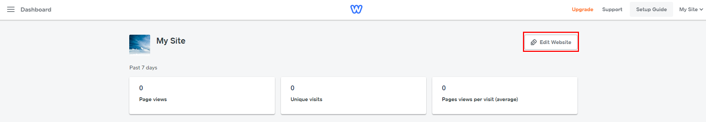
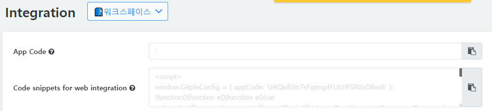
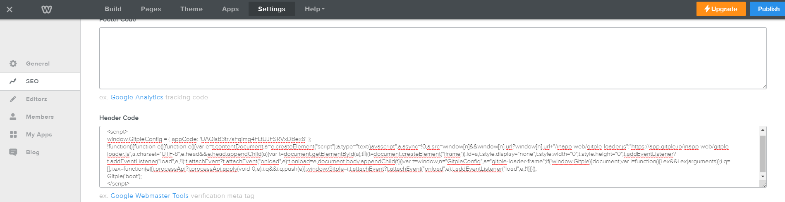
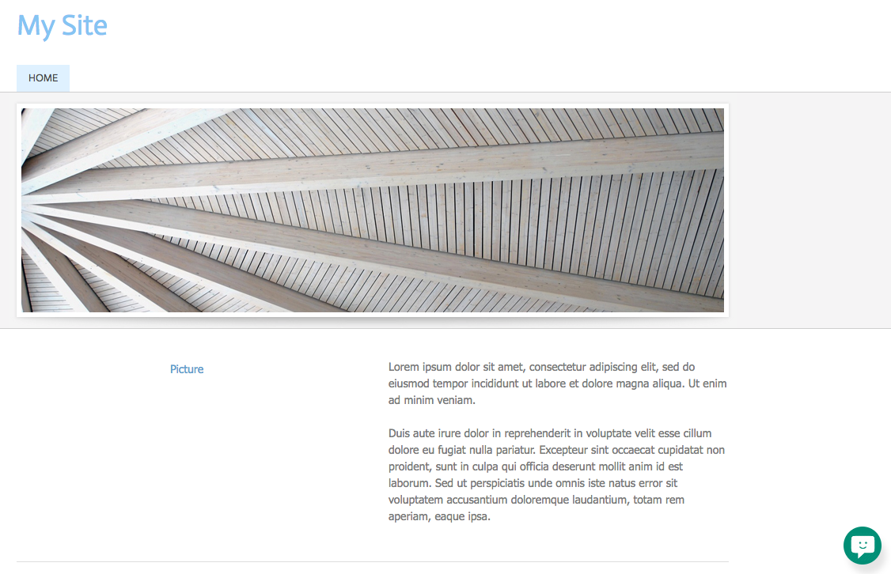

Hybrid Chatting [Gitple](https://gitple.io/en)

# Weebly link guide

Weebly address - https://www.weebly.com/

#### 1.  Press the `Edit Website` menu on the right side of the site to move.

#### 2. Copying HTML script

* Copy HTML code from the Gitple workspace> “**Settings > Integrations**"> “Code snippets for web integration” attribute.
  
* Copy from the the Gitple workspace and paste into the `header code` section of the “**SEO**” menu under the “**Settings**” tab of the Weebly 
  
* Press the **Save** button after input and select **Publish** on the upper right side.

### Starting service

If you connect the homepage, you can see that you can launch your own chat service from the bottom right (default).

Don’t you have an account yet? [Free membership](https://workspace.gitple.io/#/register/en)

---

© Gitple Inc. All Rights Reserved.
