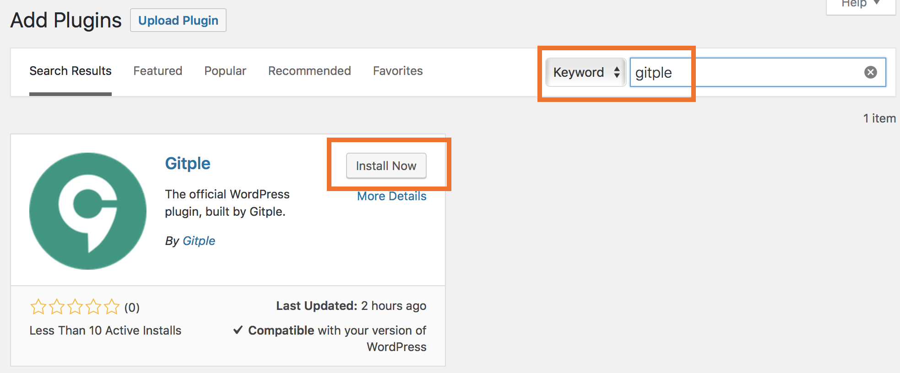
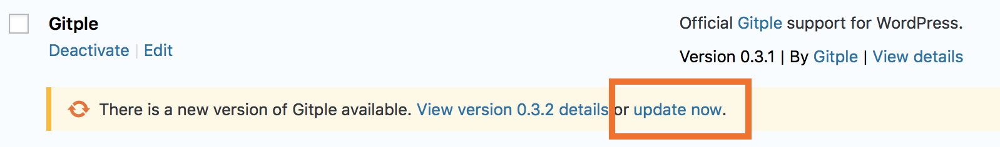
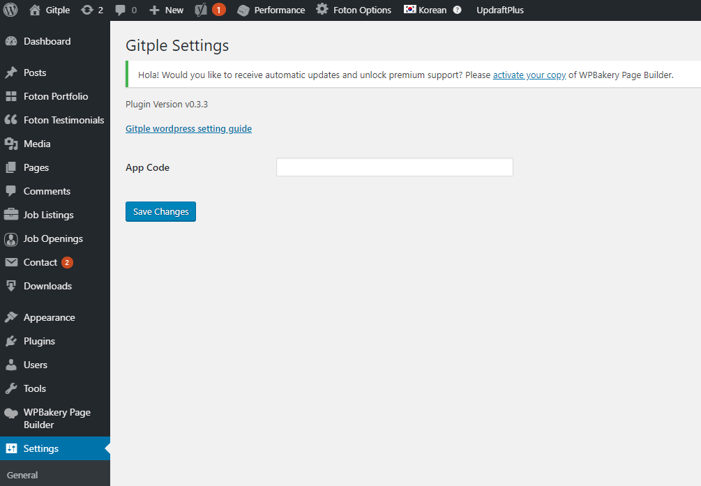

Hybrid Chatting [Gitple](https://gitple.io/en)

# Gitple WordPress link guide

This guide explains how to link the Gitple chat service in WordPress.

### Compatibility

  - PHP version 5.6 or later is recommended.

### Installation

  - First, **search and install the plug-in**. Search for `gitple` and `install` and `activate`.

    

    - If you have included existing users, you only need to update it.

      

  - When the plug-in is activated, check whether the Gitple menu is displayed on the "**Settings**” menu and execute it.

    

    * `App code`: Log into the workspace(https://workspace.gitple.io) and copy the code of the `App code` section at the bottom of the "**Settings > Integrations > Apps**” menu and input it.
      

### Starting service

If you connect the homepage, you can see that you can launch your own chat service using the Gitple launcher menu at the bottom right.

!> This plug-in inserts the `Javascript source` that contains the user data into a web page. Therefore, the chat might be delivered to a wrong user if this plug-in is used with some caching solutions because the entire page is cached.

Don’t you have an account yet? [Free membership](https://workspace.gitple.io/#/register/en)

---

© Gitple Inc. All Rights Reserved.
