## Chat

##### The livechat list is classified as following with status.

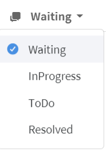

##### You can grasp the status of the entire list on the status bar in real-time at a glance.

   - The numbers on the right of the status indicator is based on the entire agent.

      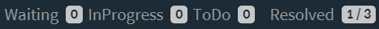

      * “2/4” after `Open`/`InProgress`/`Resolved` means that the total number of livechat is 4 and the number of livechat assigned to you is 2.
      * `Resolved` means the number of livechat processed today.

   ?> **Tip!** If you click on each part of the status bar `click`, you can move to the livechat list directly.

#### Chat list

  - Shows the list of customers assigned to you.
  - You can also see the list of other agents.

    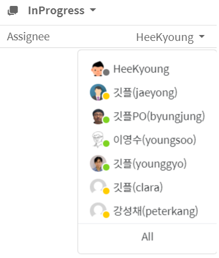

  - You can check the information of the customer during the livechat as follows, using the `user information` on the right side of the livechat window.
    - You can edit the name, phone number, and e-mail.
      - In particular, it is useful to update the information about the visitor you've provided support through the livechat.
    - You can add tags to the user directly.
      - The tagged information is used for the customer list, statistics, and agent assignments.

    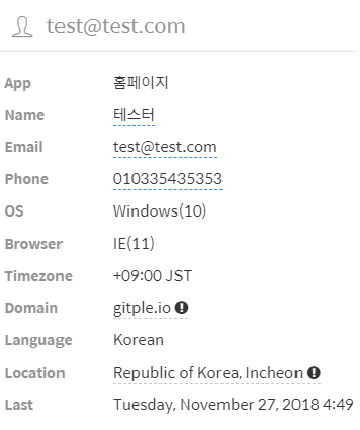

  - You can input a note during livechat, and the note will also be displayed in the livechat note when livechat is finished.
    - If you click the “Pin” check box, you can continue to check and update during customer support.

    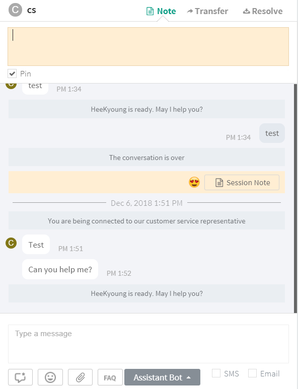

  - To complete the livechat, click the "**End**" on the upper right of the livechat window.
    - You can write a livechat note when a livechat is finished. You can also finish by pressing "**Save**" directly. 
   
      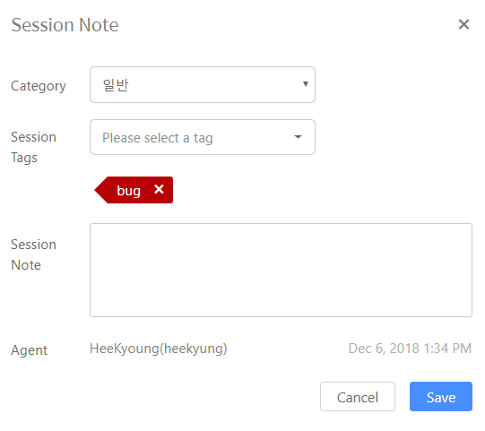

    - You can update the "**Session note**" again on the livechat window later as follows.
  
      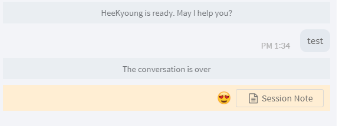

  - In the case of consultation that is difficult for you to handle
    - Specify another agent (or group) through the `Transfer` menu in the header of the dialog, or
      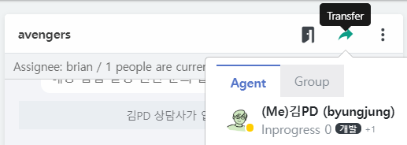
    - Other agent can join the conversation through the `Join` menu in the dialog header.
      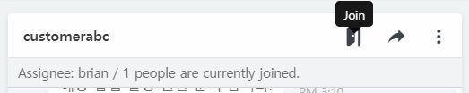

##### To do list

  - A list of customers who has left their messages. You can proceed like the livechat list.
   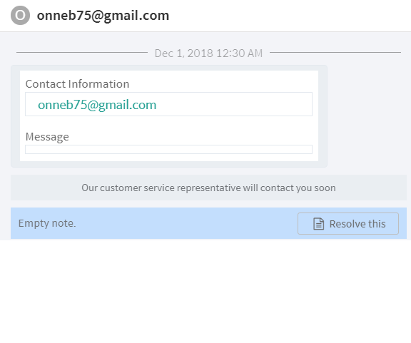
      - If the "**Session note**" is opened and saved once, it will disappear from the To do list. (Move to the Resolved list.)

##### Waiting list

  - Show a list of customers waiting to be assigned to an agent.
  - You can press "**Assign**" on the upper right side of the livechat window to move to your support list.  
 
    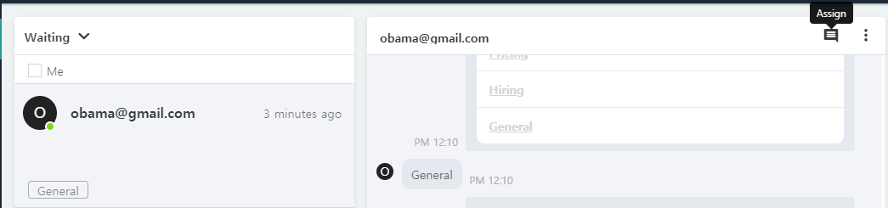
    * If the agent click “**Assign**", the livechat window will be displayed.
    * If you transfer to another agent, it can be done with the agent assignment.

##### Resolved list

  - Show a list of customers whose requests were resolved.
    - Display the number of items processed as of today, by default.
  - As with the livechat list, you can also view the list processed by other agents.
    - Unlike the livechat list, the list of support processed by all agents will be displayed by default.
