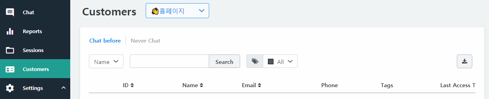
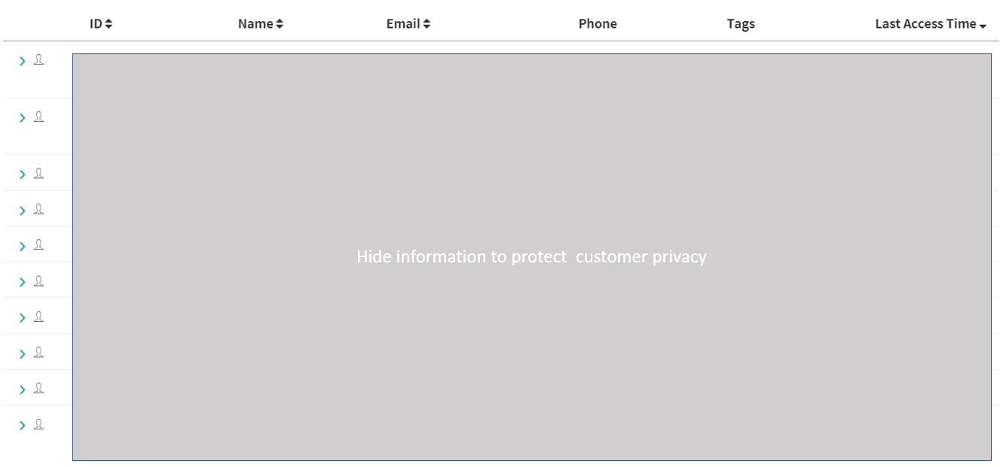
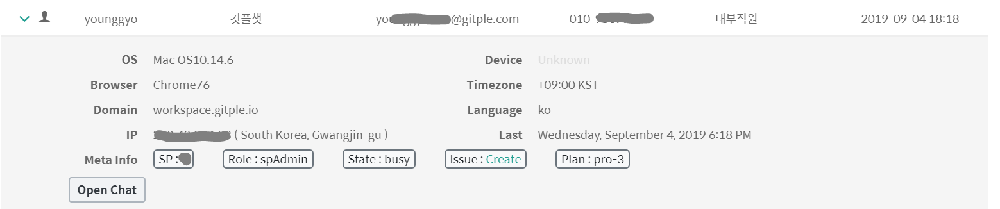

## Customers

Displays a list of customers.
  

  - Customer: A customer who have been provided customer support at least once.
    - Non customer: A customer who has not been provided customer support livechat yet. (Input the information or tried to log in only.)
  - You can search for a name, email, and ID.
  - You can also check the tagged user only.
  - You can extract the table information as a CSV file.

  - The list is sorted by the last livechat time (start time of the last session).
  - The ID is a unique ID managed within the linked service. (Reference: [Log-in customer information](http://guide.gitple.io/#/en/web-sdk?id=homepage-application-guide) ) 
    - The email address of the visitor (non-logged in customer) will be displayed as an ID.
  - In addition, the name, email, phone, OS, device, browser, language, and time zone are displayed in the table.
    - If the resolution of your monitor is low, you can scroll horizontally and see all the information.
      - The ID and name are fixed, so you can easily see who is the information owner.

  -  Click ">" and run "open chat" botton to check the livechat of the customer 
  
    

