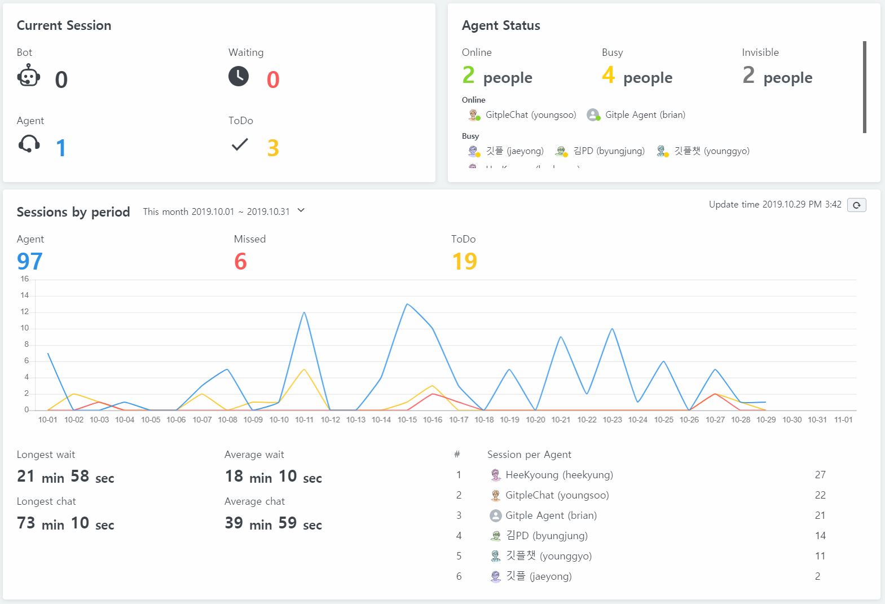

## Dashboard

You can see the real-time consultation status at a glance.
It shows the manager's needs, such as how many customers left and who worked a lot.

### Current Session

Shows the status of consultation with customers in real time.

* Bot - The number of customers connected to the bot
* Waiting - The number of waiting customers who requested an agent connection
* Agent - The number of customers who are currently talking to an agent
* ToDo - The number of customers who submitted a message

### Agent Status

It shows the current number of agents and the list according to the agent status in real time.

### Sessions by period

Show sessions status by period(Today/This week/This month, Yesterday/Last week/Last month).

You can check the latest information by pressing the update button next to the update time.

* Agent - The number of sessions assigned agent
* Missed - The number of missed customers who exited without waiting for an agent connection
* ToDo - The number of message submmission
* Longest wait - Longest agent connection wait time
* Average wait - Overall average agent connection wat time
* Longest chat - Longest consultation time
* Average chat - overall average consultation time
* Session per Agent - Table displays the number and average consultation time from the most consulted agents