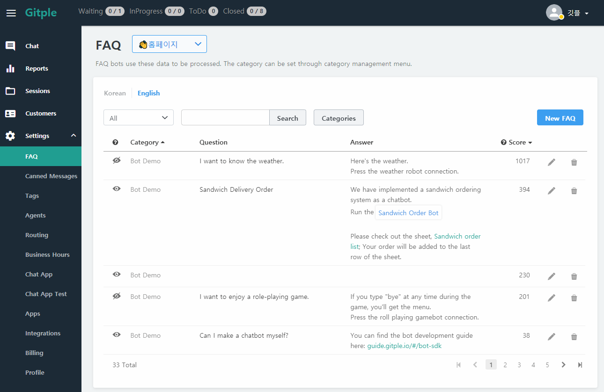
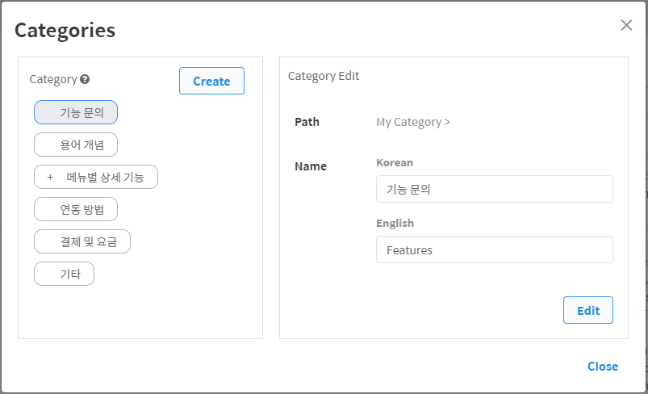
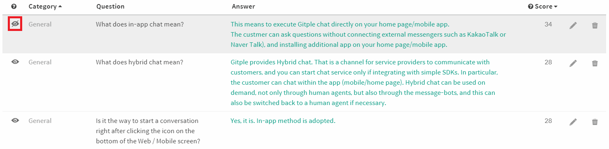
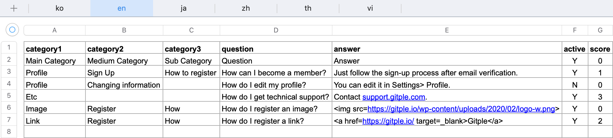
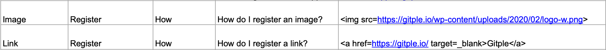
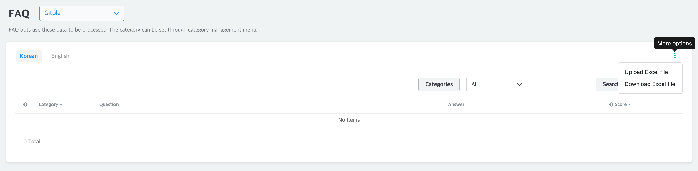
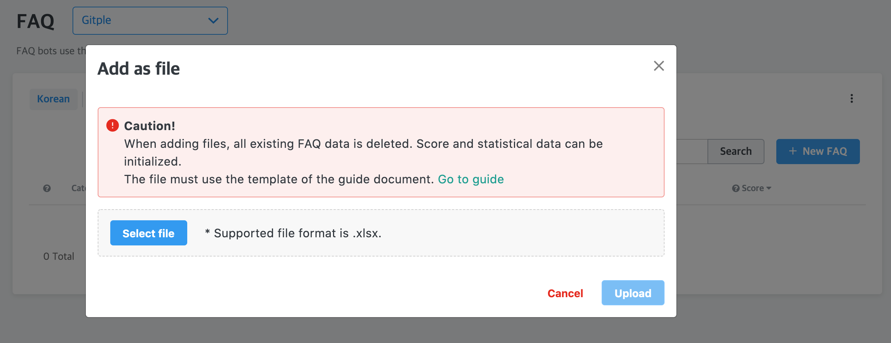
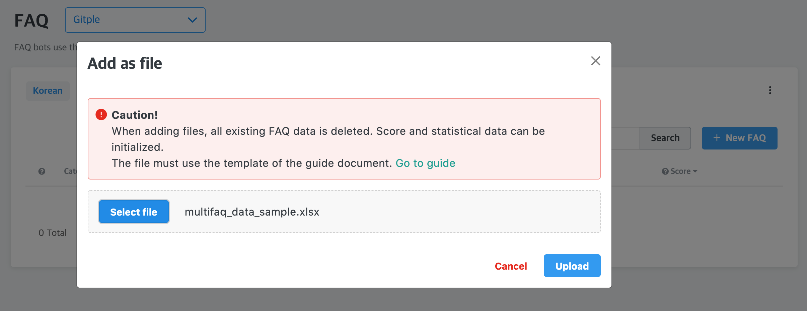

## Settings > FAQ

As the livechat data accumulated, more accurate customer support is possible.

##### 1. Edit Category

Sets the category for FAQ classification.

* You can change the category order shown to customers as follows. Click "Categories" button.

  

##### 2.  Creating FAQ

Adds a question-answer set by category

##### 3.  FAQ item

Displays each created FAQ item

##### 4.  Modifying a FAQ

Modifies the category, question, and answer.
* You can decide whether the FAQ in question will be used or not. That is, you can create a FAQ in advance or temporarily suspend it.

  

  - You can easily check the activation status using the icon in front of the FAQ list. (The first in the below figure is inactive.)

    

?> The customer can be served more efficiently as the selected FAQ category and question can be viewed on the agent screen before connecting an agent.

#### 5. FAQ Upload

You can register a large number of FAQs with Excel files. Multi-language registration is possible.

When registering multiple languages, you need to add the language to register in 'App Management> Chat App Support Language'.

- **Caution!!!**

  The existing registered FAQ is 'initialized' and registered as the content of the uploaded Excel file.
  Depending on the registration data, score / statistics information may be initialized.

  The base language sheet is a reference sheet and needs complete data. (Category, question and answer required)

  ex) If the default language is Korean, the 'ko' sheet is the reference sheet.

  When registering multiple languages, the number of data per sheet must be the same, and the same row per sheet is regarded as the same data. If the same row is not guaranteed, incorrect data may be stored.

- **Excel file registration conditions**
  1. Only counselors with admin roles can register.
  2. Only .xlsx extension files can be registered.
  3. The worksheet name must be written in the language code to be registered.
     - ko : Korean
     - en : English
     - ja : Japanese
     - zh : Chinese
     - th : Thai
     - vi : Vietnamese
  4. The Excel data structure should be written in the structure below.
     - structure
       - Please keep the A1: E1 header structure.
       
       - active: Y / N, default: Y
       - score: number, default: 0
     - condition
       - Reference sheet
         - The default language sheet is used as the base sheet.
         - Categories, questions and answers are mandatory.
         - For score data, only standard sheet information is registered.
       - Multiple languages
         - The number of data per sheet must be the same.
         - Identical rows per sheet are considered the same data.
         - The number of categories in each row per sheet must be the same as the base sheet.
       - Images and links
         - Please write in the form of html tags.
         
       - Etc
         - active and score data are saved as defaults when missing or incorrect data is entered.

- **How to register**
  1. Click the `More > Upload Excel file` in the FAQ Management menu.
    

  2. After checking the instructions, click the `Select files` button to register the .xlsx file.
    
  3. After loading the file is complete, click the `Upload` button.
    
  4. Depending on the number of data being registered, it may take some time to complete the registration.

#### 6. FAQ download

You can download the saved FAQ data as an Excel file (.xlsx).

- **Caution!!!**

  The saved FAQ data is created as below data structure.

  If there is no category or question or answer information for each language, the cell may be empty.
    

- Click the `More > Download Excel file` in the FAQ Management menu.
  