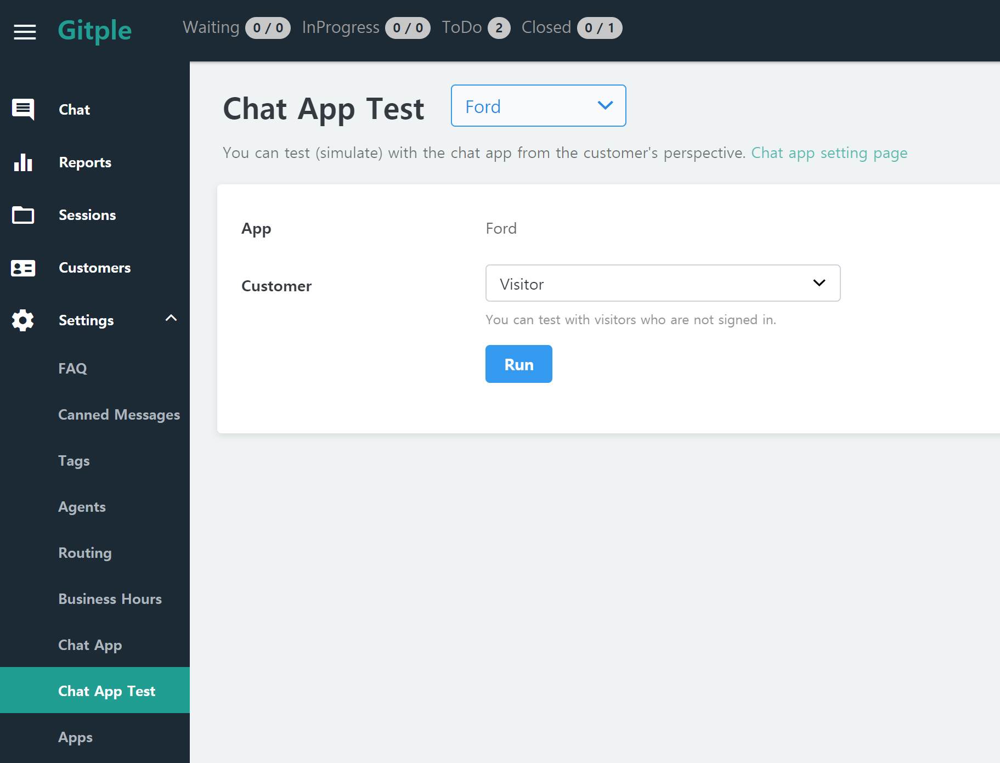
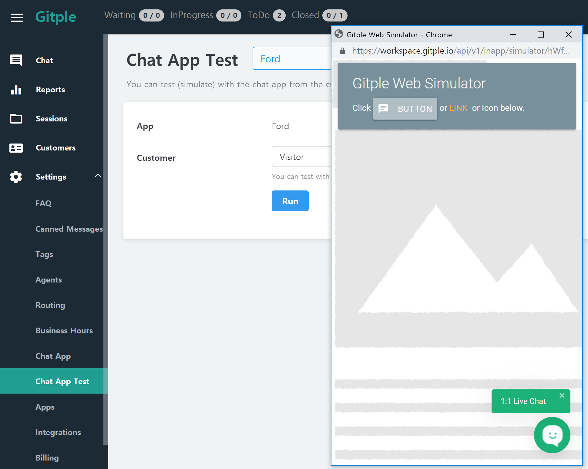

## Settings > Chat App Test

You can test the changes in the Settings and learning data immediately. (No link is required.)

#### Test in visitor mode

You can click Run directly. However, the `anonymous` attribute should be set to “**Allow**” in "**Settings > Chat App Test**"

#### Test in log-in member mode

You can input any test ID.

#### Simulator

Try to proceed with chat as if you were an actual customer by pressing the chat App icon.

