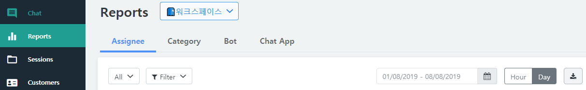
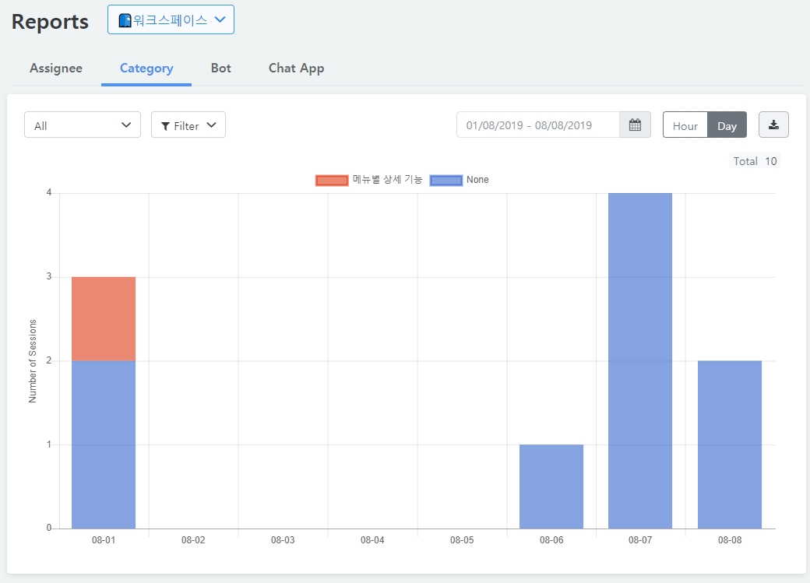
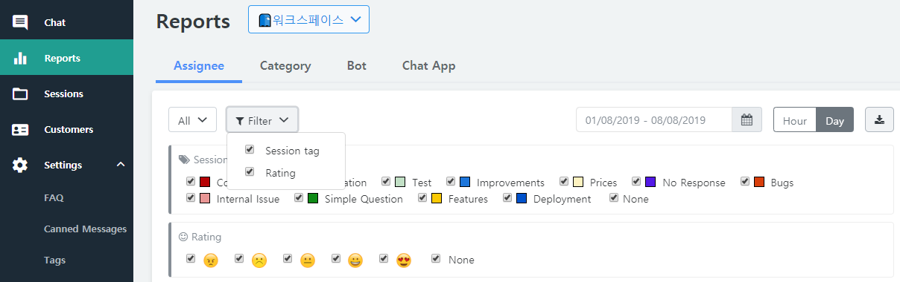
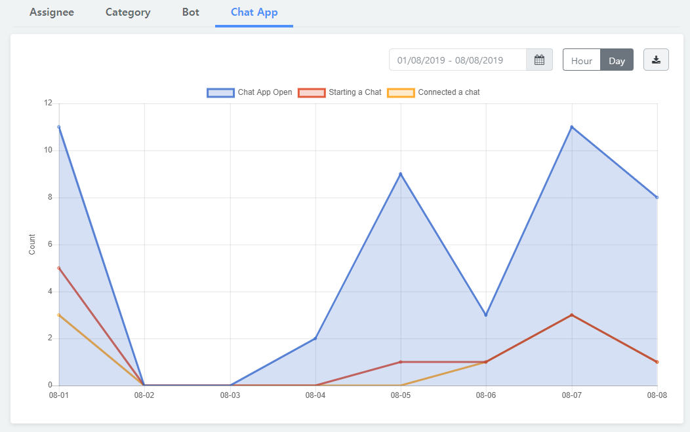
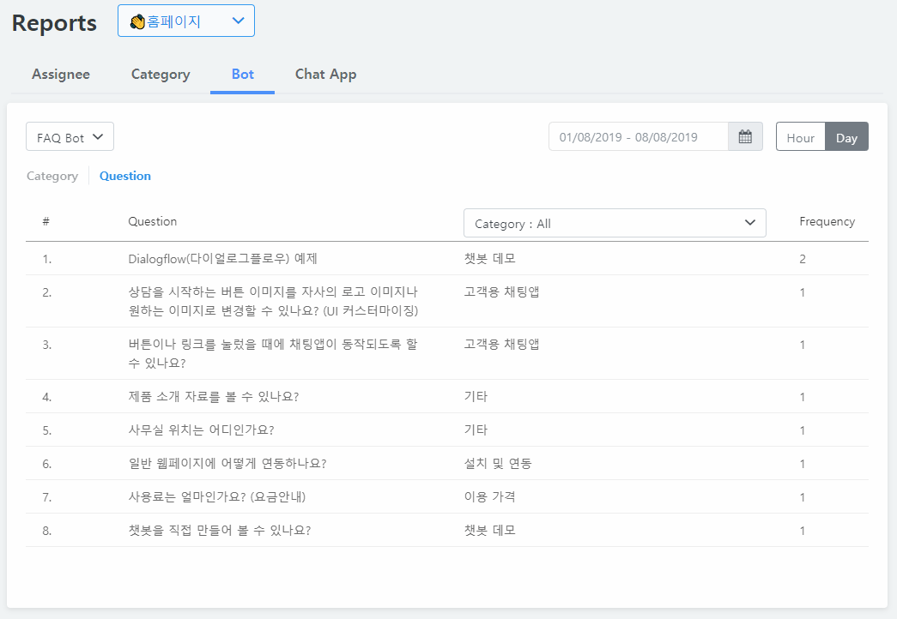

## Reports

You can view statistics by current time (day)/date (specific period).

  * Category
    - Check the throughput by FAQ category for entire livechat statistics. 
   
    * Period
      - By time - Shows statistics on a specific date by hour
      - By day - Shows statistics by one day after specifying the start and end date.
    * Filter
      - Chat tag - Shows statistics about the selected tag only.      
    * Download
      - Download the statistical data (CSV format)

   
  * Agent
    - Check the throughput by agent for entire livechat statistics.
  * Chat app
    - Show how many times customers used the chat App at a glance. 
      - Click the chat App open
      - Click the Starting a Chat
      - Click the Connected a chat
   
  * Bot
    - Provides the meaningful data analysis for each bot.
    - Example of the FAQ bots
      - Shows the frequency of questions (categories) by rank
   
