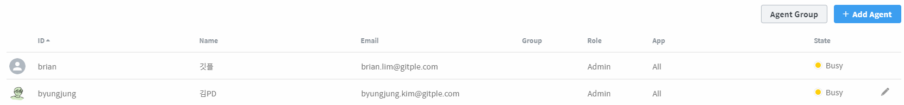
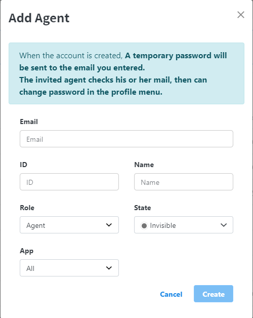
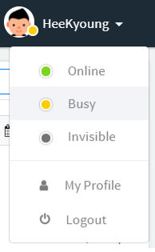

## Settings > Agents

Shows all agents including administrators.

#### Changing the role and state

  If you select the Edit icon on the rightmost, you can change the **role and state**.

#### Adding an agent

  

  - When you add an agent, an **invitation e-mail will be sent automatically (like the first sign-up welcome e-mail)**.
  - You can find the delete menu at the far right of the table for the added agent.

#### Agent status

The three agent statuses can be set as follows.
  * In-progress: Customer chat is ready.

    
      - You can change your status as above.
  * Busy: Unable to support temporarily due to other business.
  * Hidden: No chat is available. (*Reference: If all the agents are in a hidden state, the end-customer doesn’t wait for an agent.*)
