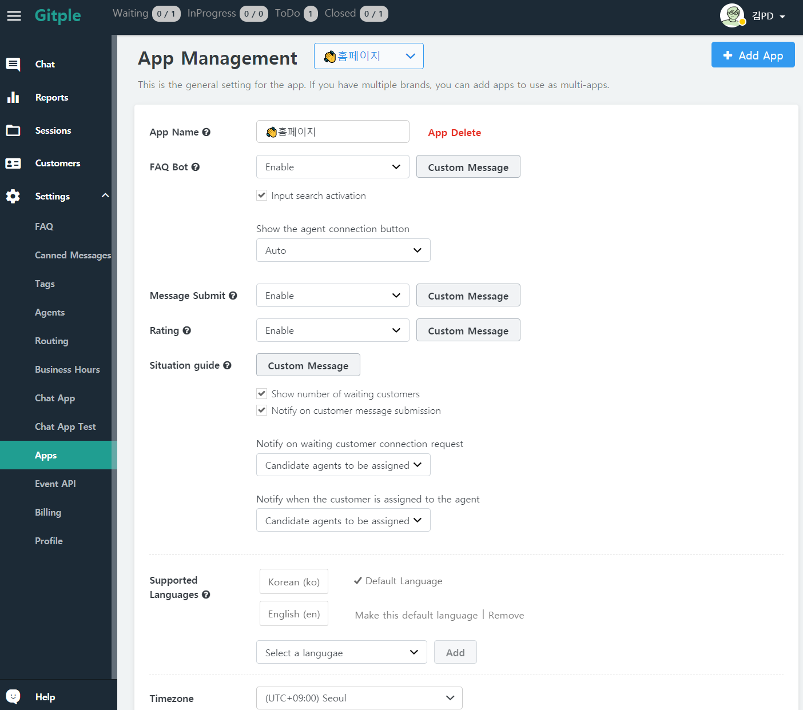
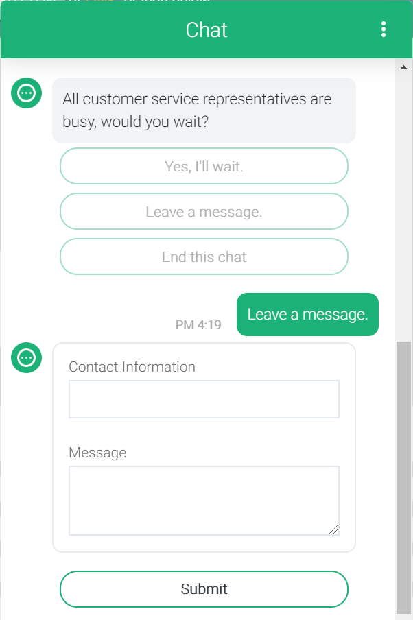
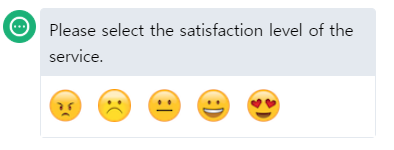
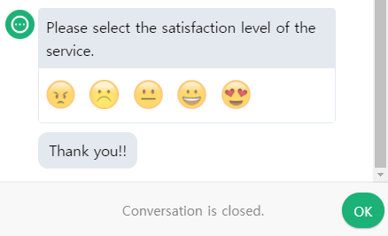
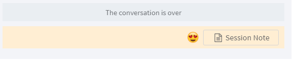
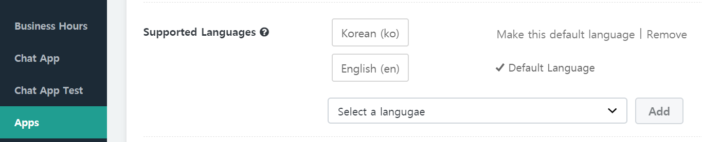

## Settings > Apps

  

### App Name

Set up this app name for each your brand. ([Multi-App](https://guide.gitple.io/#/en/multiapp) case)

### FAQ bot

As the FAQ bot serves customers 24 hours a day regarding frequently asked questions, the agent can focus more on important customer inquiries.

* Custom Message
  When activating the FAQ guide bot feature, modify the basic message of each guide step  
  ( e.g., When start, When select a category, When finished, etc. )

* Input Search Activation
  
  Based on the registered FAQ data, customers can search for questions in the input box.
  
  - Allowing input is the default setting.
  - If you don't allow input searches and only want to interact with customers through a given category and question selection, you can uncheck the box.

* Show the agent connection button
  
  Determine when the customer will be able to connect to an agent when talking to a FAQ bot.

  - **Auto**: FAQ bot decision (default option)
    - Currently, after the first level category is decided OR after faq search (whether answer is existing or not)
  - **Always**: Customer can always connect to the agent.
  - When the first level category is decided
  - When the last level category is decided
    - Including faq item selected case because no more category to be selected
  - **Never**: Customer cannot connect to the agent

### Message submit

When the agent is busy or absent, this bot supports customer chat 24 hours a day by receiving the customer requests on behalf of the agent and transferring them to the agent.

* When activating the message submit feature, modify the basic message for each input label
  ( e.g., the contact label, the message body label, the submit button )

* Example of the time when all agents are in conversation.

  

### Rating

The level of satisfaction of chat support can be collected from the customer when completing support request and can be used as data to improve the quality of the chat service.

* Custom Message
  - When rating, modifiy the corresponding default message 

* When the agent finishes the livechat and leaves the livechat window, the customer can evaluate the level of satisfaction as shown below. 
  
  

* The customer can finish the livechat by pressing OK after evaluating the level of satisfaction. (At this time, the agent will not be involved.)

  

* Satisfaction results will be displayed next to the session note.

  

### Situation guide

Agent assignments, waiting and reception guides, and so on. Detailed settings allow you to receive an alert whenever a customer is connected to an agent.

* Show number of waiting customers
  - It shows in the chat how many people are currently waiting. (The phrase can be changed)
* Notify on customer message submission
  - Will be notified when a message is received from a consulting customer.
* Notify on waiting customer connection request
  - In case of `Candidate agents to be assigned`, Notification will be given if there is a candidate to be assigned by transfer or skill assignment. (Otherwise it is the same as `all agents`)
* Notify when the customer is assigned to the agent
  - When you want to be notified only to the agent who will chat to the customers, then select `Assigned agent`.

### Supported Languages

You can add a language to be supported by the chat.

For example, you can serve customers who speak in English by setting English as the default language as shown below.

Tip -  [Go to Multilingual customer support tutorial](en/multilang)

### Timezone

You can set a time zone for each app.
