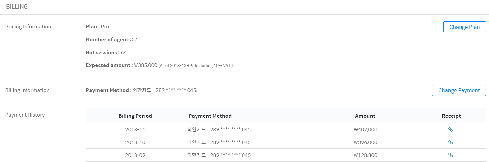

## Settings > Billing

You can check the rate system currently in use and payment details.
- You can change the rate system using the “**Change plan**” button.
- You can register your credit card using the "**Change payment**” button.

