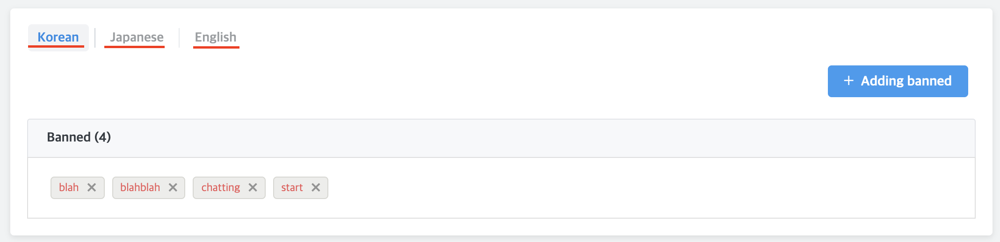

## Settings > Dictionary

You can manage synonym, banned

### Synonym

To make the FAQ search more smoothly, we manage the synonym that cannot be searched.

##### Register synoynm

1. `Setting` -> `Dictionary` ->  Click the `Add synonym` button

`Noun` : When searching the FAQ, enter the words to match.  
`Synonym` : When searching for a FAQ, enter the synonym you want to actually  search with regard to the representative words.   
`Add Words`: Adding a `Synoynm`

##### Synonym scenario example
It can be applied to various scenarios as below.  

1. FAQ: How much is the **bus** fare?  
`Noun` : **bus**, `Synonym`: **vehicle**

2. FAQ: When is customer center **operating hours**?  
`Noun` : **operating hours**, `Synonym` : **business hours**

3. FAQ: I can't remember the **password**.  
`Noun` : **password**, `Synonym` : **PW**, **identification**

--- 
### Banned
Manage banned

* Used to limit specific words of the counselor.
* You can add banned through the 'Adding banned' button.
* You can limit specific words by language as shown below. ( Based on ** the language set by the browser ** )

* When the counselor is caught in banned on counseling, the following screen appears.
  - Pressing 'Enter' again will ignore the warning and send the content.  ( Banned : `blah`, `blahblah`, `chatting`, `start`)

 
