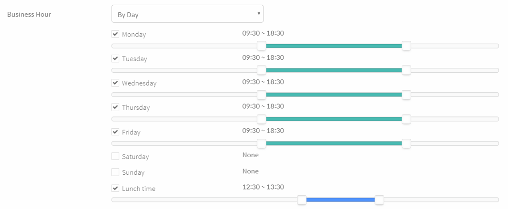

## Settings > Business Hours

### Business hours

* You can set “Always” or details "By Day".
  - If you select “**By Day**”, it can be set as follows. Or, you can set "**Lunch time**" additionally.
  

### Holidays

* Upcoming holidays setting
   * You can specify the name of the day or the specific period.
   * These holidays are not repeated. In other words, even if it is a holiday that repeats every year, you need to specify it additionally.
