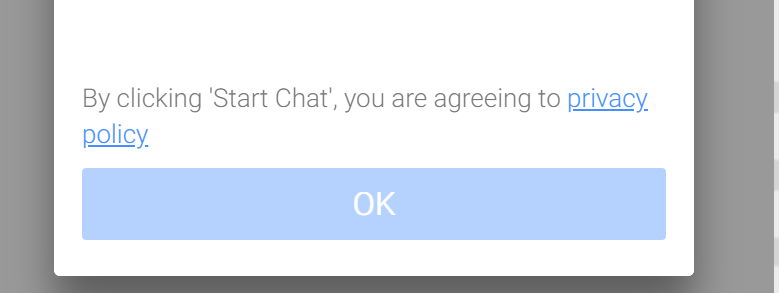

## Settings > Chat App

#### Theme colors

Support five colors as the theme of livechat window UI (mint, blue, red, yellow, black)

#### Change the style

You can change the livechat App UI other than the built-in theme to the desired style. ([See the tutorial](en/inapp-custom-style.md))

#### How to display the icon

Set how the livechat App icon will be displayed inside the web page

* Lower left or lower right
* Automatic icon display
  - (Checked) Shows the built-in livechat App on the screen (default setting).
  - (Unchecked) Launches the livechat App using the pre-linked button, image, or link ([See the tutorial](en/linkopen.md))
* Using the custom icon
  - Select the check box if you want to use your own icon in addition to the built-in icon.([See the tutorial](en/customicon.md))
    - The maximum file size to upload is 3 MB, and you can freely specify the image size now.
  
#### Tooltip

?> Separated the content into separate pages. Check [How to use tooltip](/en/tooltip.md).

#### Anonymous(Visitor)

A visitor refers to a user who is not a member or a member but has not signed in. You can decide whether the livechat of the visitor will be `Allow` or `Disallow`.

* You can select **Required/Optional/None** for the e-mail, phone, or name.
  - If no input has been received, the system assigns a random value to the user to distinguish.

* Use when “Agree to personal information collection and use” needs to be displayed.
  - Include a link to your actual privacy policy and terms and conditions in the URL input window.
  - It will be displayed as below.

    

#### Chat App displaying phrase
You can edit text for the items below.

* `Title` phrase
  - Title of the chat App header
* `Intro` phrase
  - The phrase that appears on the [Start chat] button when you click on the chat App icon. (HTML format is acceptable.)
* `Start` button phrase
* `Connect` button phrase
