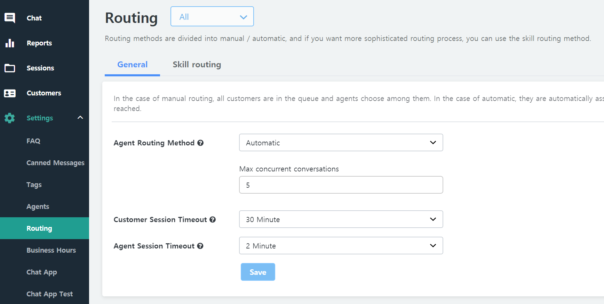

## Settings > Routing

Distributes customer requests effectively when there are several agents.

#### Automatic assignment
If a customer connects an agent, it will be automatically assigned to an agent.
* Basic method (if the number of real-time livechat requests is small)
  - Assign an agent with less assigned livechat requests
  - If agents have the same number of assigned livechat requests, assign the agent whose last livechat is oldest.
  
* Maximum number of simultaneous support sessions
  - The maximum number of customers that the agent can respond can be adjusted.

    ?> An agent can get more livechat explicitly. For example, even if the agent has reached the maximum number of concurrent livechat requests, the requests on the waiting list can be added to the livechat list of the agent in question if the agent “**changes to chat**”.

#### Manual assignment
When a customer connects to an agent, the customer waits until an agent is manually selected and assigned.

#### Chat set-up
* Time to keep the **customer** chat
  - If the end-customer doesn’t input any text for the specified time, the chat will be automatically ended explicitly.
* Time to keep the **agent** chat
  - If the agent doesn’t input any text for the specified time after customer assignment, connection to another agent will be attempted.
    - At this time, the agent who does not respond to the customer automatically changes to a `busy` state.
    - However, in the case of manual assignment, it moves to a waiting list instead of connecting another agent.
* Hiding abuses (systematic system processing)
  - Customer’s abuses will be marked with *, so that the agent doesn’t see them.

#### Skill Routing

!> Please see this [Skill Routing Guide](en/skillrouting).
