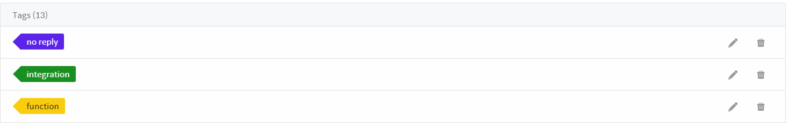
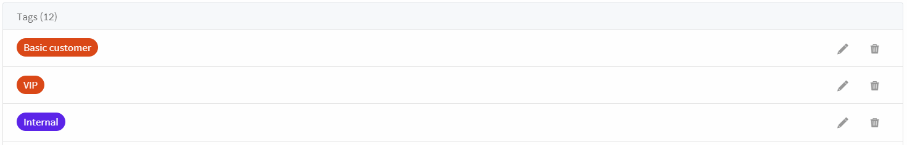

## Settings > Tags

You can classify chat more quickly using tags and manage it systematically (statistical processing, etc.).

There are two types of tags as shown below and can be applied as shown in the example figure.

* Session tag - tagging about chat details

  

* Customer tag- tagging about customers

  
