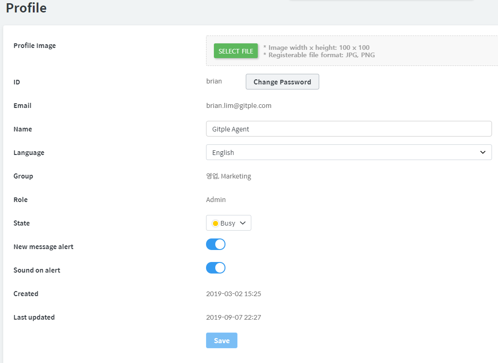

## Settings > Profile

Sets the agent's personal profile. Click the "**Save**" button after change.

* Profile Image
  - Displayed not only in the workspace but also in the chat App.
* ID
* Email
* Name
* Language
  - Support Korean and English
* Group
* Role
  - Administrator or general agent
* State
* New message alert
* Sound on alert
  - The desktop also generates a sound when an alarm occurs.
* Created 
* Last Updated 
