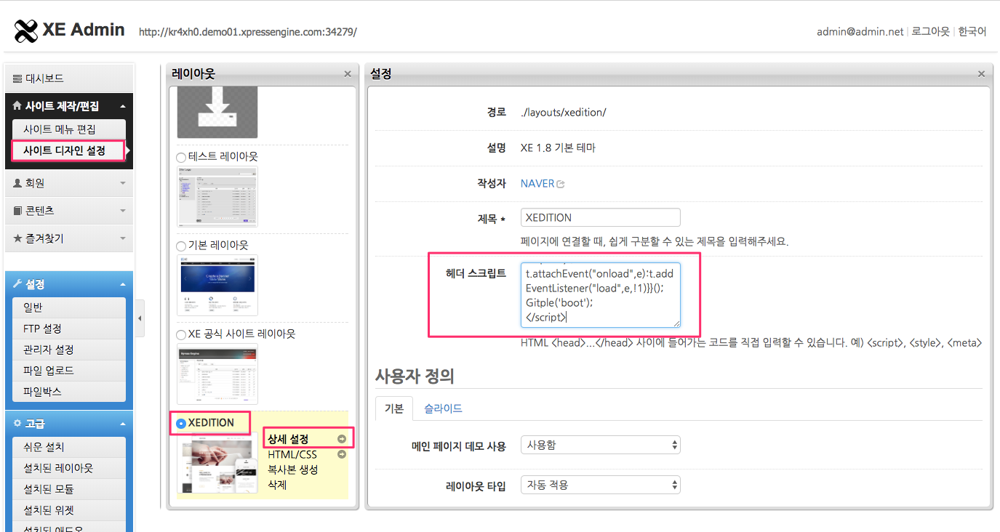
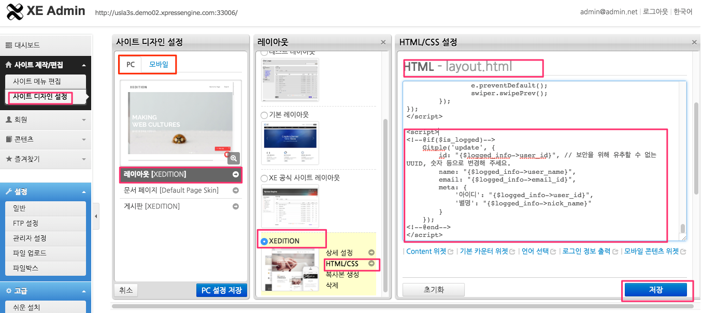

Hybrid Chatting [Gitple](https://gitple.io/en)

# XE1 link guide

#### 1. After logging in as an administrator, execute `Administrator mode` > `Create/Edit site` > `Site design settings` > `Select layout` > `Detailed setting` in turn.


 

#### 2. Copying HTML script
* 깃플 워크스페이스 > "설정 > 연동" > "웹연동 스크립트 코드" 속성에서 HTML 코드 복사
* Copy HTML code from the Gitple workspace> “**Service setting > Chatting App**"> “Code snippets for web integration” attribute.
* Find the `header script` section on the layout setting screen of XE1 and paste the HTML code as shown in the figure above.

!> When selecting a layout, add both `PC` and mobile. <br>
Don’t forget to press the `Save` button at the bottom of the screen after pasting the code.

### Starting service

If you connect the homepage, you can see that you can launch your own chat service from the bottom right (default).


### How to link the log-in user

#### After logging in as an administrator, execute `Administrator mode` > `Create/Edit site` > `Site design settings` > `Select layout` > `HTML/CSS` in turn.

Find `HTML-layout.html` on the `HTML/CSS setting` screen and add the following code.

```php
<script>
<!--@if($is_logged)-->
    Gitple('update', {
        id: "{$logged_info->user_id}", // Please change it to a UUID (lowercase), a number, etc. that can not be guessed for security reasons.
        name: "{$logged_info->user_name}",
        email: "{$logged_info->email_address}",
        meta: {
            '아이디': "{$logged_info->user_id}",
            '별명': "{$logged_info->nick_name}"
        }
    });
<!--@end-->
</script>
```



!> When selecting a layout, add both `PC` and `mobile`.  <br>
Don’t forget to press the `Save` button at the bottom of the screen after pasting the code.

  * However, change the id to a UUID (lowercase), a number, etc. that cannot be guessed for security reasons.
  * You can add the required value to the meta data.
  * Please refer to the [Changing from a non log-in user to a log-in user guide](https://guide.gitple.io/#/en/web-sdk?id=changing-from-a-non-log-in-user-to-a-log-in-user)


Don’t you have an account yet? [Free membership](https://workspace.gitple.io/#/register/en)

---


© Gitple Inc. All Rights Reserved.
