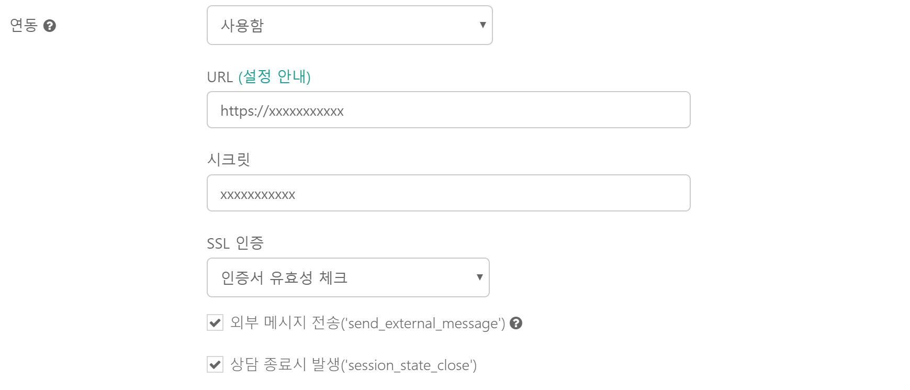
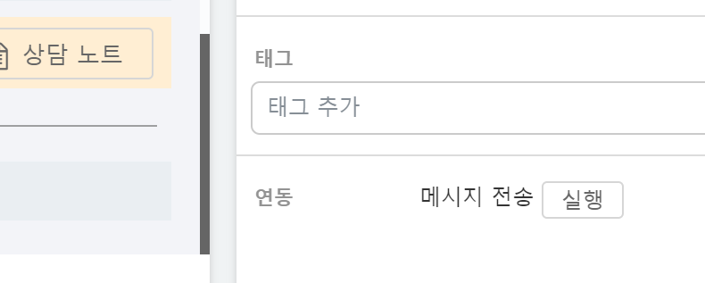

하이브리드 채팅상담 [깃플](https://gitple.io)

# Event APIs

## Integration Setting

워크스페이스 "**설정 > 연동**" 메뉴에서 설정할 수 있습니다.



* URL
  * 호출(POST)할 REST API 주소를 입력합니다.
  * 전송 보안을 위해 HTTPS를 권장합니다.
* 시크릿
  * 깃플에서 보낸 안전한 API 호출임을 판단(데이터 위변조 등)하기 위해, 각 HTTP 호출시 마다 payload에 대한 해시값이 `X-Hub-Signature` 헤더에 추가됩니다.
  * 해시값은 입력한 시크릿(Secret)을 기반으로 HMAC(sha256)의 digest를 사용합니다.
* SSL Verification 설정
  * HTTPS를 사용하는 경우, 올바른 인증서 인지를 체크하기 위해 `HTTPS 공인인증서 유효성 체크`의 설정을 권장합니다.
  * 적용할 이벤트 타입 선택 (Binding Event)
* 이벤트
  * 외부 메시지 전송(`send_external_message`)
    * 고객정보 화면의 하단에 연동 메뉴(`메시지 전송`)가 자동으로 추가됩니다.
      * 
        * 상담사 입력한 메시지를 실어서 입력된 API를 호출합니다.
  * 상담 생성시 발생(`session_state_open`)
    * 상담 생성시 세션 기본 정보를 실어서 입력된 API를 호출합니다.
  * 상담 배정시 발생(`session_state_inprogress`)
    * 상담 배정시 세션 기본 정보를 실어서 입력된 API를 호출합니다.
  * 상담 종료시 발생(`session_state_close`)
    * 상담 종료시 세션 기본 정보를 실어서 입력된 API를 호출합니다.

## API Spec

* `Header`는 공통적용 됩니다.
* 전달되는 시간의 규격은 모두 **UTC** `Date` 포맷 입니다.

### Headers

```json
{
  'X-Hub-Signature': 'sha256=HASH_SIGNATURE_DIGESTED_BY_SECRET'
  'content-type': 'application/json'
}
```

### send_external_message

* Payload 예제

  ```json
  {
    triggerId: "trigger_query_id",
    ctime: "2019-04-29T08:57:15.878Z",
    appCode: "YOUR_OWN_APP_CODE",
    type: "send_external_message",

    from: {
      type: "agent",
      id: "agent_query_id"
    },

    to: {
      type: "user",
      id: "user_query_id",
      identifier: "integrated_user_id"
      anonymous: false,
      name: "user_name",
      email: "user_email",
      phone: "user_phone",
      lang: "ko",
      groups: ["aaa"],
      tags: ["xx", "yy"]
      meta: {
        your_key_1 : "your_value_1"
        ...
        your_key_n : "your_value_n"
      }
    },

    message: {
      type: "text/plain",
      content: "AGENT_TYPED_MESSAGE"
    }
  }
  ```

* to 의 사용자 정보는 [API Spec Document](http://guide.gitple.io/api)의 `user` 부분을 참고해주세요.

### session_state_close

* Payload 예제

  ```json
  {
    triggerId: "trigger_query_id",
    ctime: "2019-04-29T09:05:56.001Z",
    appCode: "YOUR_OWN_APP_CODE",
    type: "session_state_close",

    session: {
      id: "session_query_id",
      openTime: "2019-04-29T08:57:15.878Z",
      inprogressTime: "2019-04-29T08:57:15.943Z",
      closeTime: "2019-04-29T09:05:56.000Z",
      reason: "userCancel",
      userId: "user_query_id",
      userGroups: ["xxxx"],
      assigneeType: "agent",
      assigneeId: "agent_query_id",
      categories: ["aaa", "bbb"],
      tags: ["sss", "tttt"],
      note: "session_note_message",
      meta:[]
    }
  }
  ```

* open 과 inprogress 의 payload 도 위와 같은 방식입니다.
* session 의 자세한 정보는 [API Spec Document](http://guide.gitple.io/api)의 `session` 부분을 참고해주세요.
* session-meta에 대한 자세한 정보는 [Session Meta](http://guide.gitple.io/#/session-meta)의 `session_state_close` 부분을 참고해주세요.
---

© Gitple Inc. All Rights Reserved.
