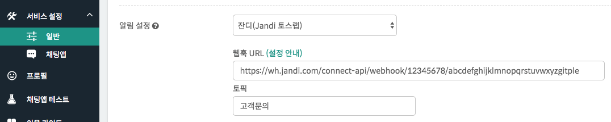

하이브리드 채팅상담 [깃플](https://gitple.io)

# 외부 메신저 알림 

워크스페이스를 항상 열어놓고 대기하지 않아도, "**설정 > 앱관리**" 의 "**상담 안내**"와  "**설정 > 연동**" 의 "**추가 알림**" 속성을 이용해서 고객문의를 인지할 수 있습니다.

기존에 회사에서 사용하던 메신저를 활용하여, 고객문의 알림을 받을 수 있도록 함

### 메신저 리스트 바로가기

* [슬랙(Slack)](#Slack)
* [매터모스터(Mattermost)](#Mattermost)
* [잔디(Jandi)](#Jandi)
* [하이웍스(Hiworks)](#Hiworks)
* [아지트(Agit)](#Agit)
* [팀룸(Teamroom)](#Teamroom) 

## Slack
  1. 슬랙 사이트에 접속해서 로그인을 한다.

  2. 아래와 같이 **Incoming WebHooks**를 선택합니다.
    

  3. 선택하면 아래와 같이 웹훅을 추가할 수 있는 **Add Configuration** 메뉴를 들어갑니다.
    

  4. 알림을 받기 위한 채널을 선택하고, 다음 과정을 진행하면 아래와 같이 **Webhook URL**이 나옵니다.
    

  5. 깃플 화면("**설정 > 연동 > 추가 알림**)에서, 해당 URL과 채널을 입력해 주신 후, "**저장**" 버튼을 눌러주세요.
    

## Mattermost

위에서 설명한 슬랙(Slack)과 유사하게 설정하시면 됩니다.

  1. Mattermost 화면의 왼쪽에 있는 드롭다운 메뉴에서 Integrations 를 선택합니다.

  2. 'Incoming Webhook' 을 선택합니다.

  3. 'Add Incoming Webhook' 을 누릅니다.

  4. 입력란을 채우고, 알림 받을 채널을 지정한 후, 'Save' 를 합니다.

  5. Webhook URL 이 정상적으로 생성되는 것을 확인할 수 있습니다.

  6. Webhook URL 을 복사해서 워크스페이스에 붙여넣으시면 됩니다.(위 슬랙 안내 참고)

## Jandi
  1. 잔디 화면의 메뉴에 아래와 같이 **잔디 커넥트** 버튼을 선택합니다.

    
  2. 선택한 후 **Incoming Webhook** 를 검색하고, **연동항목 추가하기** 를 눌러줍니다.
    
  3. 알림을 받기 위한 토픽 설정을 마친 후, 아래와 같이 **Webhook URL**을 복사해 줍니다.
    
  4. 깃플 화면("**설정 > 연동 > 추가 알림**")에서, 해당 URL과 토픽을 입력 후, "**저장**" 버튼을 눌러주세요.
    

    !> 토픽은 위 3번 잔디 설정 화면에서 선택한 이름과 일치해야 합니다.

## Hiworks
  - [하이웍스 공식 가이드](https://customer.gabia.com/manuals/detail_pop.php?seq_no=2755)
  - 발급 완료 후, 이제 깃플 화면("**설정 > 연동 > 추가 알림**")에서 복사해둔 URL을 입력 후, "**저장**"하시면 됩니다.

## Agit
  - [아지트 공식 가이드](https://agit.io/apps/19)
  - 발급 완료 후, 이제 깃플 화면("**설정 > 연동 > 추가 알림**")에서 복사해둔 URL을 입력 후, "**저장**"하시면 됩니다.

## Teamroom
  먼저, 네이트온에서 제공하는 **팀룸**을 추가합니다.

  
  
  1. 팀룸을 생성하셨다면, 메뉴에서 `오픈 API 연결하기` 를 선택합니다.

  

  2. **Incoming Webhook** 에서 `새로 연결하기` 를 선택합니다.

  

  3. 이름과 수신할 모임을 선택하고 저장을 하시면 완료됩니다. **Webhook URL** 을 복사해 두세요.
    - 예제에서는 '채팅문의' 이름과 '대표모임' 을 선택했습니다.

  

  4. 이제 깃플 화면("**설정 > 연동 > 추가 알림**")에서 복사해둔 URL을 입력 후, "**저장**"하시면 됩니다.

*현재 페이지의 끝부분 입니다.*

---

© Gitple Inc. All Rights Reserved.
