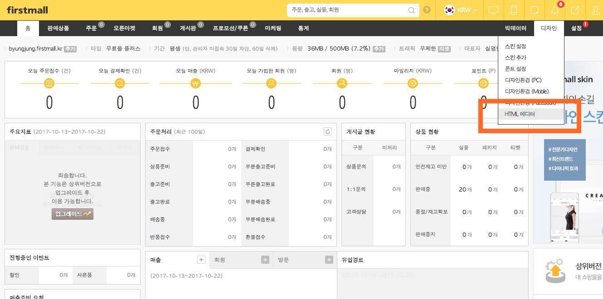
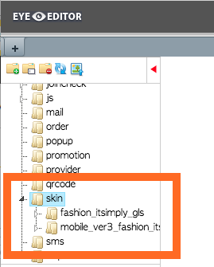
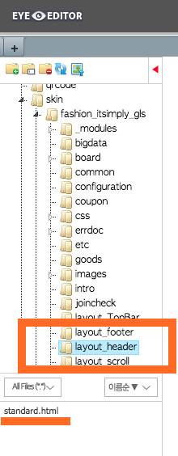
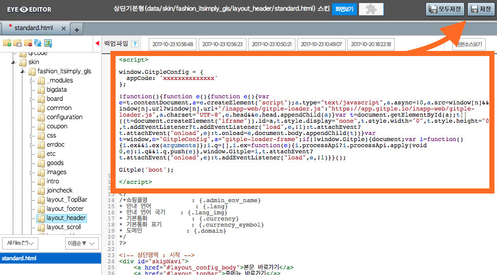
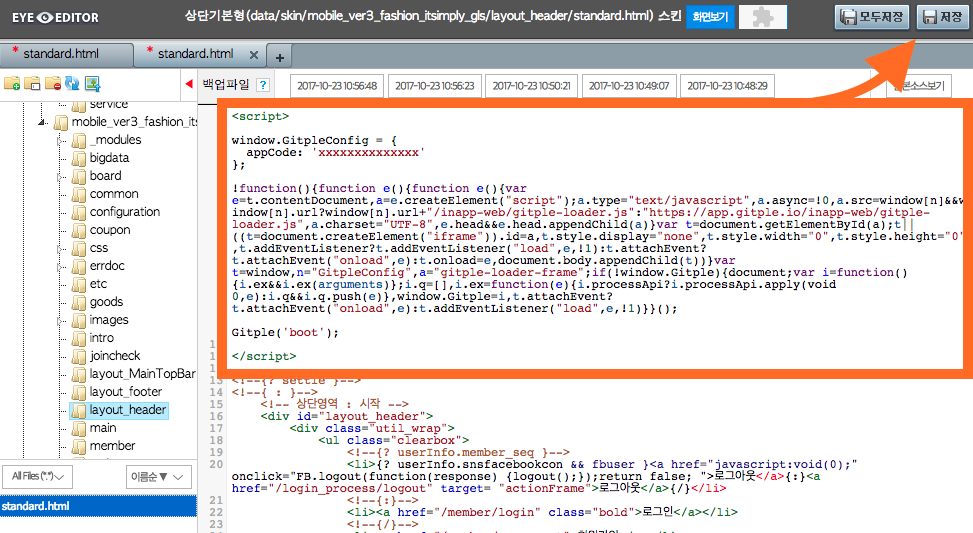
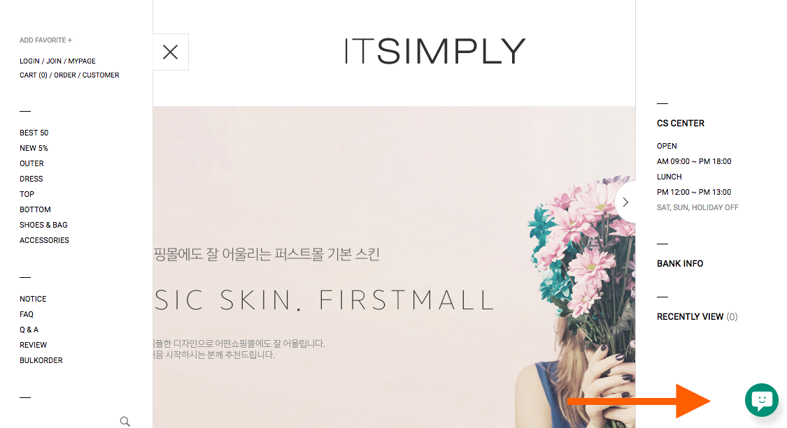
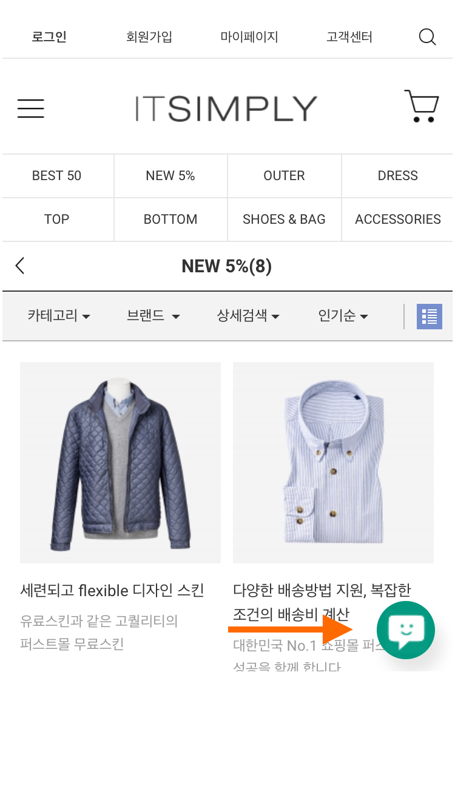

하이브리드 채팅상담 [깃플](https://gitple.io)

# 퍼스트몰(firstmall) 연동 가이드

퍼스트몰 주소 - http://www.firstmall.kr/

#### 1. 관리자로 접속해서 사이트의 오른쪽에 있는 `디자인` 메뉴를 눌러서 `HTML 에디터`를 실행합니다.

#### 2. 실행된 에디터창에서 아래와 같이 `skin` 폴더를 찾습니다.

사용 환경에 따라 폴더 수와 이름이 다를 수 있습니다.

#### 3. 각 폴더별로 `layout_header` 폴더에 있는 `standard.hml` 파일을 엽니다.

(폴더를 선택하시면) 아래에 나와있는 standard.html 부분을 더블클릭하시면 됩니다.

#### 4. HTML 스크립트 복사하기
* 깃플 워크스페이스 > "**설정 > 연동**" > "웹연동 스크립트 코드" 속성에서 HTML 코드 복사
* 열린 standard.html의 맨 첫 부분에 HTML 코드를 붙여넣음

아래 예시와 같이 모든 폴더에 적용해 줍니다.

첫번째 폴더 예시)

두번째 폴더 예시)

!> 붙여넣기를 하신 후에, 오른쪽 위의 `저장` 하기를 잊지 마세요.

### 서비스 시작

홈페이지에 접속해보시면, (기본) 오른쪽 하단에 여러분 만의 채팅상담 서비스가 가능해진 것을 확인할 수 있습니다.

PC 예시)

모바일 예시)

이상입니다.

아직 계정이 없으시다구요? [무료 회원 가입](https://workspace.gitple.io/#/register)

---

© Gitple Inc. All Rights Reserved.
